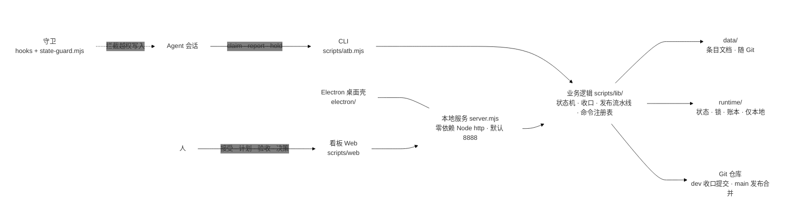

# 设计文档

适用版本：20260921-001（全功能基线版），发布计划 BLD-20260921-001（待发布）。本文说明 agent-team-board 的总体结构与关键机制设计，面向需要了解实现和取舍的开发者；使用入门见 [README.md](./README.md)，能力清单见 [FEATURES.md](./FEATURES.md)。

## 设计目标

agent-team-board 要解决的问题是：**一个人与多个 AI Agent 在同一条任务流里稳定协作**。人把精力花在决策上（接受什么、先做什么、是否验收），执行（分析、编码、测试、写文档）交给 Agent；双方每一次交接都落成可追溯的文件与提交，而不是聊天记录。

四条贯穿设计：

- **人机分工落在状态机上**：谁在什么状态下能做什么，由系统约束而不是文档约定。
- **执行产物全部文件化**：条目是目录、内容是 Markdown、收口是 Git 提交，人与 Agent 读写同一介质。
- **本地优先**：一个 Node 进程加一个 Git 仓库即可运行，无外部服务、无账号体系；数据可备份、迁移和审计。
- **能力可回退、入口可收敛**：实验能力（CI 看板、独立批量 Commit）已回退；文件、讨论、营销与旧发布模块保留代码但隐藏入口，不影响主流程。

## 总体架构

- **入口层**：浏览器看板（原生单页应用）、CLI、Electron 桌面壳三个入口共享同一份服务与数据。
- **服务层**：`scripts/server.mjs` 以 Node 内置 http 实现零依赖本地服务（默认端口 8888，`ATB_PORT` / `ATB_HOST` 可调），对外提供 JSON API 与静态资源。
- **业务层**：`scripts/lib/` 按域拆分——条目与状态机（core）、认领与自动收口（commit-store）、发布流水线（publish-flow）、文档总结与翻译（docs-summary / docs-translate）、受阻决策（hold-*）、命令注册表（cli-registry）等。
- **存储层**：条目文档在 `agent-team-board/data/`（随 Git 管理），运行态在 `agent-team-board/runtime/`（仅本地）。
- **横切守卫**：钩子把 Agent 宿主的写操作引导到 `scripts/state-guard.mjs`，无有效锁时拦截越权写入。

零依赖 http、Markdown + Git 存储的完整取舍理由见 [README.md](./README.md)「设计思路与架构」。

## 条目生命周期

需求与 Bug 统一为「条目」，编号形如 REQ-20260921-001 / BUG-20260921-001。

- 前进边中只有「认领」属于 Agent；接受、移入计划、确认完成与三条回退边全部由人工触发。Agent 的常规状态操作只有 `atb claim` 与 `atb report`。
- 「待测试」不是独立状态：开发中条目上报后以待测试形态展示，人工验证后确认完成。
- 受阻（hold）不改变状态：Agent 用 `atb hold declare` 声明问题清单，条目保持开发中，问题进入「待人工确认」区，人工作答后复工。状态定义中保留了早期方案对齐流程的历史状态以兼容旧数据，界面上不出现。
- 状态文件位于 `runtime/status/`，由 atb 子命令独占维护，直写会被守卫拦截。

## 收口与提交归属

自动收口保证「每单一提交」：认领时系统记录工作区快照，`atb report` 时按快照对比归因本单改动，自动提交到 dev 分支（只 commit 不 push）。提交目录范围可在设置中配置，默认只提交源代码相关目录；条目文档（用户数据）随单提交，runtime/ 运行态永不入库。提交主题强制带条目编号，规范在 commit-store 中校验。

## AI 协作流水线

两条并行队列，都以「复制提示词到 Agent 会话」为派发方式——看板不直接运行模型，提示词是看板与 Agent 会话之间的契约：

- **AI 分析**：面向已接受条目，补齐说明文档与验收标准；涉及界面时产出可交互的 HTML 演示。成果确认后可自动转入计划（可配置，默认手动）。
- **AI 开发**：面向已计划条目，主会话按提示词分派子代理逐单执行「认领 → 测试先行 → 实现 → 上报」，收口自动提交。
- **人工介入点**统一为「待人工确认」：受阻声明、自动提交归属存疑、AI 分析确认，都在看板补决策后恢复。
- 任务全局视图汇总各项目的活动任务；执行账本仅保存在本机。

## 版本发布流水线

发布模块按五步推进，每步有明确门禁：**版本计划 → 关联条目与提交 → 文档编写 → 合并入 main → 正式发布**。

- **版本计划**：版本号取计划编号（BLD-20260921-001 → 20260921-001）；AI 可完善名称与描述，人工就地编辑。
- **关联条目与提交**：关联已完成条目及其收口提交；合并前做提交归属隔离分析——独立变化可单独发布，未选依赖可一键全部加入，已在主分支的共享提交不误判为混合提交。
- **文档编写**：三阶段——AI 总结默认语言文档（本版为 README / CHANGELOG / FEATURES / AGENTS / DESIGN）并逐文件人工审核；AI 翻译语言集内其余语言（语言集可配置，默认 cn,en）并逐文件审查；全部文件整体审查完结后解锁文档提交。预览支持 Markdown 渲染。
- **合并入 main**：逐条 `--no-ff` 合并保留完整历史（不采用 rebase），在隔离工作树中执行，日常工作目录保持在 dev，main 观感用 `--first-parent` 浏览；历史仓库无 main 时兼容 master。
- **正式发布**：人工触发推送主分支，推送完成即锁定基准，该版本不可再合并或完善。

## 命令与分支浏览

- **命令模块**：atb 全部 CLI 命令由服务端注册表（白名单）统一下发，看板按分组以按钮呈现：填参 → 预览完整命令 → 执行并回显输出、退出码与耗时；高危命令二次确认。「最近执行」按命令去重保留 10 条并持久化，点击回填参数快速重跑。
- **分支浏览**：提交历史渲染为泳道式提交树，展示分叉、合并曲线与 tag 落点；搜索支持高亮定位与过滤（只保留匹配及其祖先）两种模式；main 与 dev 各自只显示本分支提交。开发分支可「先 fetch 再推送」与远端对齐；main 的推送只走发布流程。

## 可靠性与安全

- **状态守卫**（PreToolUse 钩子）：拦直写状态文件、拦无锁改源码，文件编辑与 Bash 两种模式同口径；根 README.md 例外（纯文档，无锁可更新）；看板数据目录豁免。
- **锁模型**：认领锁 24 小时失效，残留锁用 `atb prune-locks` 清理；AI 分析、AI 开发、AI 总结、AI 翻译各自持独立锁，互不占用。
- **服务边界**：默认只绑定回环地址（`ATB_HOST` 显式放宽）；内容安全策略（CSP）、MIME 白名单、路径防穿越；图片端点仅放行图片后缀并有独立大小上限。
- **前端性能**：2 秒主轮询加签名剪枝——数据签名未变不重绘，不打断正在进行的填写与展开；模块进入幂等，重复进入不重复拉取。
- **国际化**：界面文案以中文原文为键集中在 scripts/web/i18n.js，静态精确匹配英文、动态插值，文案改动强制双语同步。
- **测试基线**：scripts/tests/ 下 330 余个测试文件，`npm test` 顺序聚合执行；开发流程要求测试先行（先红后绿），测试文件以条目编号命名，可从缺陷直接追溯到用例。

## 技术选型摘要

| 选型 | 取舍 |
| ---- | ---- |
| 零依赖 Node http | 无框架升级与供应链维护面，本地单进程足够 |
| Markdown + Git 存储 | 人与 Agent 共用介质，历史与审计免费获得；不追求高并发与复杂查询 |
| 原生前端 + 少量本地打包库（提交树、Markdown 渲染、语法高亮、目录树） | 无构建步骤、无前端框架依赖 |
| Electron 桌面壳 | 复用同一本地服务，打包 mac（DMG）与 Windows（NSIS）；不含签名与商店流程 |
| data/ 与 runtime/ 分层 | 协作产物进 Git 随仓库分发；运行态仅本地，机器状态不进发布 |

[返回 README](./README.md) · [更新日志](./CHANGELOG.md) · [功能说明](./FEATURES.md)
