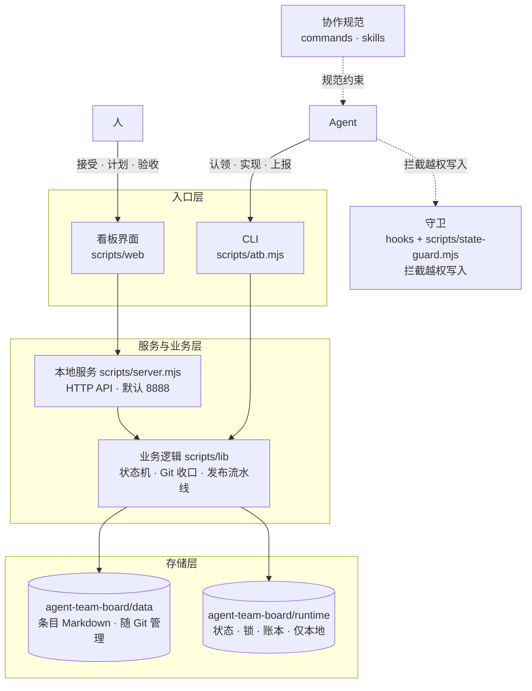
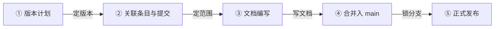
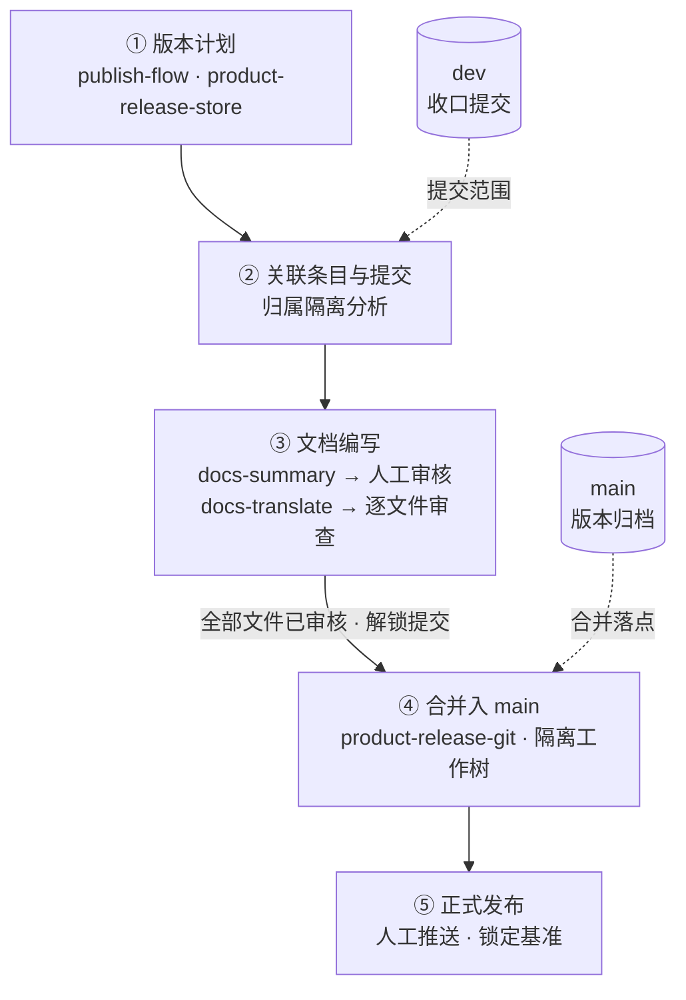
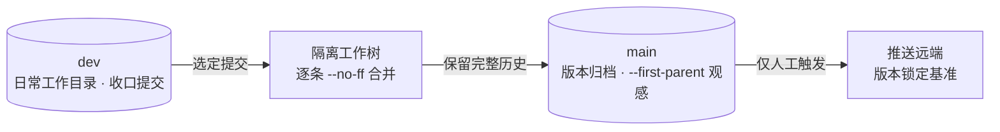

# 方案说明

## 用户痛点

随着 AI 大模型的能力越来越强大，越来越多人通过 AI Agent 来开发产品。我也不例外。日常使用 Codex 和 Zcode。

但是当前 AI Agent 都有一个通病：它们的聊天会话列表设计之混乱，是在你添加了 10 个以上会话之后就能立刻深切感知到的问题。

归根结底，这些 Agent 更像是一个聊天工具，而不是一个产品开发工具。

既然厂商不给力，那我就自己上吧。

## 设计思路

产品开发要标准化，关键是做好三个管理：「需求管理」、「发布管理」和「质量管理」。

需求管理负责将想法变为可落地的代码，发布管理负责将代码变成可分发的产品。质量管理是一切的兜底。

### 需求管理

市面上有很多成熟的需求管理工具，但那些都是给古法编程用的工具，在 Vibe Coding 的今天，需求管理需要借助 AI Agent 来实现更高效、更稳定的需求开发流程。尤其是对「一人公司」来说。

#### 设计原则

- **人在回路**：人负责接受、计划、验收等决策；AI Agent 负责分析、开发、测试与上报等执行。看板是双方唯一的协作界面，状态由系统流转，不靠口头约定。
- **硬约束优于约定**：条目状态机由系统管理（Agent 的常规状态操作只有认领与上报），源码改动受 Agent 钩子守卫保护，开发收口由系统按认领时快照自动提交。规则不写在文档里等人或 AI 遵守，而是写进工具里强制生效。
- **本地优先**：一个 Node 进程加一个 Git 仓库即可运行，无外部服务、无账号体系。数据在自己机器上，随时可备份、迁移和审查。
- **简单胜于一切**：古法编程时代，多分支并行开发是引入复杂性的艰难选择。「一人公司」时代，双分支就足够了。一条 dev 分支负责需求按序开发，main 分支负责发布版本归档。
- **记忆永续**：每个需求和 Bug 条目都是一个文档目录，每次收口是一次 Git 提交，每个版本以提交为依据。出了问题可顺着条目、提交与版本计划逐层追溯。只要指定条目编号，Agent 就能快速找回曾经的「记忆」，不管是新开会话，还是多 Agent 协作。

#### 架构设计

- **入口层**：浏览器看板（原生单页应用）、CLI 共享同一份服务与数据。
- **服务层**：`scripts/server.mjs` 以 Node 内置 http 实现零依赖本地服务（默认端口 8888，`ATB_PORT` / `ATB_HOST` 可调），对外提供 JSON API 与静态资源。
- **业务层**：`scripts/lib/` 按域拆分——条目与状态机（core）、认领与自动收口（commit-store）、发布流水线（publish-flow）、文档总结与翻译（docs-summary / docs-translate）、受阻决策（hold-*）、命令注册表（cli-registry）等。
- **存储层**：条目文档在 `agent-team-board/data/`（随 Git 管理），运行态在 `agent-team-board/runtime/`（仅本地）。前者是人与 Agent 的协作产物，后者是系统运行的状态账本。
- **横切守卫**：钩子把 Agent 宿主的写操作引导到 `scripts/state-guard.mjs`，无有效锁时拦截越权写入。

#### AI 协作流水线设计

两条并行队列，都以「复制提示词到 Agent 会话」为派发方式——看板不直接运行模型，提示词是看板与 Agent 会话之间的契约：

- **AI 分析**：面向已接受条目，补齐说明文档与验收标准；涉及界面时产出可交互的 HTML 演示。成果确认后可自动转入计划（可配置，默认手动）。
- **AI 开发**：面向已计划条目，主会话按提示词分派子代理逐单执行「认领 → 测试先行 → 实现 → 上报」，收口自动提交。
- **人工介入点**统一为「待人工确认」：受阻声明、自动提交归属存疑、AI 分析确认，都在看板补决策后恢复。
- 任务全局视图汇总各项目的活动任务；执行账本仅保存在本机。

使用提示词，而不是使用 SDK 或 CLI 在看板中直接运行模型，这个取舍有几点好处：

1. 在所有 Agent 中都可以使用，因为并不是所有 Agent 都提供 CLI 或 SDK 的。
2. 不违反厂商 Coding Plan 的使用协议。厂商协议中往往要求 Coding Plan 必须使用客户端，SDK 必须走 API 按量计费。两者的成本不是一个数量级。
3. 不浪费厂商赠送的额度。众所周知，在 Zcode 桌面客户端中使用智谱模型是有额外 50% 的额度的。各个厂商为了推广他们的客户端，一定是比 API 计费有优惠的。而额度就是最好的优惠。看看 Tibo 都被称为重置之神，就可以理解在这个世界上，额度为王是定律来的。

因此，我选择了提示词，代价是一点拷贝粘贴的重复工作量。

#### 用 Markdown + Git 作为存储架构

本产品把任务数据存为 Markdown 文件并用 Git 管理，不引入数据库：

- **人与 Agent 共用同一介质**。Agent 原生读写纯文本，Markdown 无需驱动、连接串或查询层；人用任何编辑器都能直接查看和修改，AI 会话与看板看到的是同一份数据。
- **版本历史与审计免费获得**。Git 天然记录谁在何时改了什么；开发收口按单自动提交，改动归属清晰，发布文档与版本计划能以真实提交为依据核实。
- **零部署、零运维**。没有服务进程要启动、没有 schema 要迁移、没有独立备份策略要维护——`git clone` 即得全部数据，`atb rebuild` 还能从 Git 历史重建运行状态。
- **diff 就是评审界面**。条目文档的每次改动都可读、可审、可回滚，人和 Agent 都能直接阅读 diff 完成确认。
- **数据与代码同生命周期**。条目说明、设计与报告随仓库分发，新成员克隆即获得完整上下文，不依赖某台机器上的数据库实例。

这一取舍也划出了边界：Markdown + Git 不追求高并发写入、复杂查询和海量数据，任务看板不需要这些。需要事务性保证的运行态（状态、锁、设置、执行账本）以 JSON 存放在 `agent-team-board/runtime/`，仅本地留存、不进 Git——「文档进 Git、运行态留本地」是这套存储设计的核心分层。

## 发布管理

版本发布的核心是定好范围，写好文档，锁好分支。

1. 定好范围，才知道要在文档里面写什么。
2. 写好文档，才知道用户怎么使用你的产品。
3. 锁好分支，才能让版本稳定。

所以发布看板里面，按照**版本计划 → 关联条目与提交 → 文档编写 → 合并入 main → 正式发布**这五步进行功能迭代。

设计上，五步是一条「可逆性递减」的流水线：越靠前越容易改，越往后越不可逆，决策按这个顺序收敛，次序不能颠倒。

**范围由提交定义，不由文字定义**。版本包含什么，看关联的收口提交，而不是需求描述或 dev 分支上恰好存在的功能。多单并行收口后，「哪些提交属于这个版本」是发布真正的难题；归属隔离分析在合并前逐提交核对：独立变化可单独发布，依赖未选可一键补齐，已在 main 的共享提交不会误判为混合提交。

**文档在合并前写，以范围为准**。文档编写放在合并之前，依据已确定的提交范围——发布后才补的文档必然与代码脱节。两阶段（AI 总结 → 人工逐文件审核 → AI 翻译 → 逐文件审查）的分工是 AI 产出、人把关，全部文件审核通过才解锁提交，未审内容不出门（BUG-20260926-002 起不再设整体审查完结确认）；已回退或隐藏入口的能力按实际状态写，不按计划写。

**合并保留历史，发布不打扰开发**。逐条 --no-ff 合并：合并节点让版本边界在历史中可见；不用 rebase，收口提交的 hash 与归属链保持稳定；合并发生在隔离工作树，dev 上的日常开发不被发布中断。main 用 --first-parent 浏览，观感上始终是一条干净的版本线。

**推送是人的最后一道门**。推送 main 不可撤回，因此只由人工触发，不进入任何自动流程；推送完成即锁定基准，版本此后不可再合并或完善——用不可变性保证「已发布」的确定性。

#### 技术方案

发布能力由三块承载：版本记录 `product-release-store` 承载五步阶段门禁，是唯一事实源；文档编写由 `docs-summary-store` 与 `docs-translate-store` 两个独立 store 分阶段推进，各有独立锁；Git 操作收敛到 `product-release-git` 在隔离工作树内执行。

- 版本记录统一推进：计划、关联提交、文档阶段进度都在同一份版本记录里，任一时刻能回答「这个版本进行到哪一步」。
- 文档阶段状态机：总结、审核、翻译逐段解锁，全部文件审核通过才放行文档提交（BUG-20260926-002 起无整体审查完结步）。

分支与合并模型：发布从不触碰 dev 的工作目录，main 只在隔离工作树中被推进。

- 逐条 --no-ff：每个条目一个合并节点，版本边界在历史中可见，单条归属可直接回溯，不需要事后拆分混杂的提交。
- dev 与 main 职责封闭：dev 只进不发布，main 只发布不开发；main 的推送只存在于发布流程这一条通道。

## 质量管理

质量管理不是发布前的检查动作，而是嵌在每个流程入口的约束。核心是 TDD 理念：测试先行，用例即规格，规则写进工具里强制生效。

- **测试先行**：每个条目先写测试、先跑红，实现后跑绿；测试文件以条目编号命名（如 bug-20260922-001.test.mjs），任何一条需求或缺陷都能直接追溯到用例。
- **回归基线**：交付前 npm test 全量必须通过；既有行为被用例钉住，改动是否破坏历史能力由全量测试回答。
- **状态机兜底**：流程正确本身也是质量。Agent 的常规状态操作只有 claim 与 report，接受、计划、确认完成仅限人工，条目不经验收不算完成。
- **守卫拦截**：PreToolUse 钩子拦直写状态文件、拦无锁改源码、拦不合规范的提交；文件编辑与 Bash 两种通道同口径，不靠自觉，靠确定性拦截。
- **提交可归因**：提交主题强制带条目编号（commit-store 校验），收口按认领时快照归因，每笔改动可追溯到单。

[返回 README](./README.md) · [更新日志](./CHANGELOG.md) · [功能说明](./FEATURES.md)
