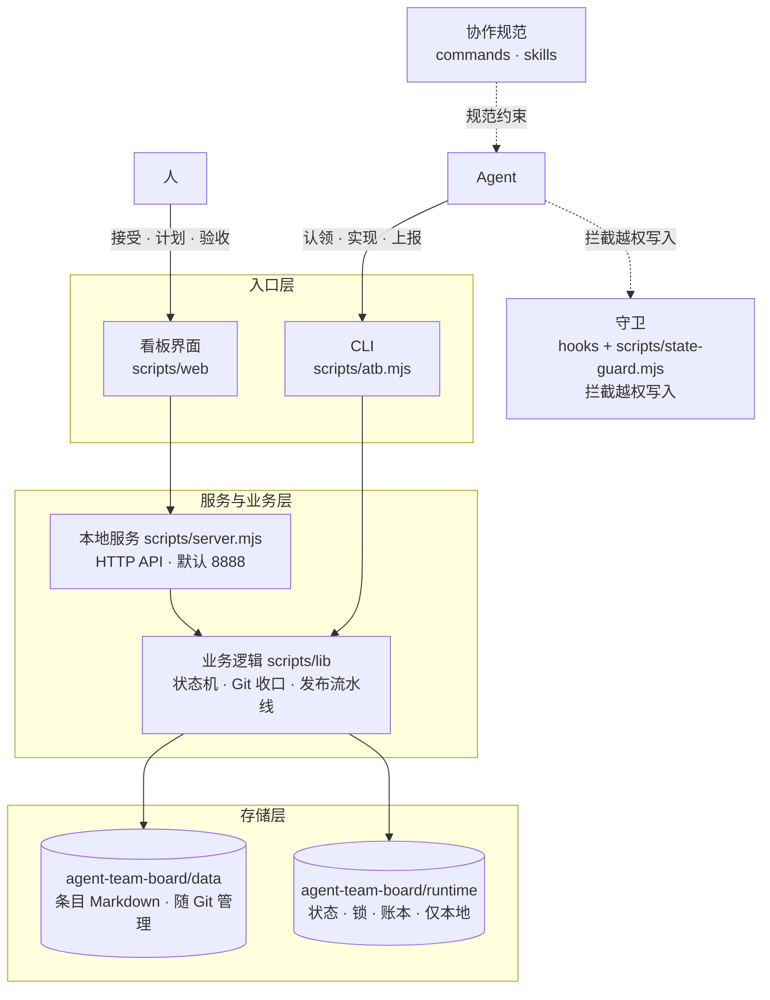
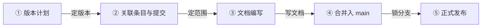
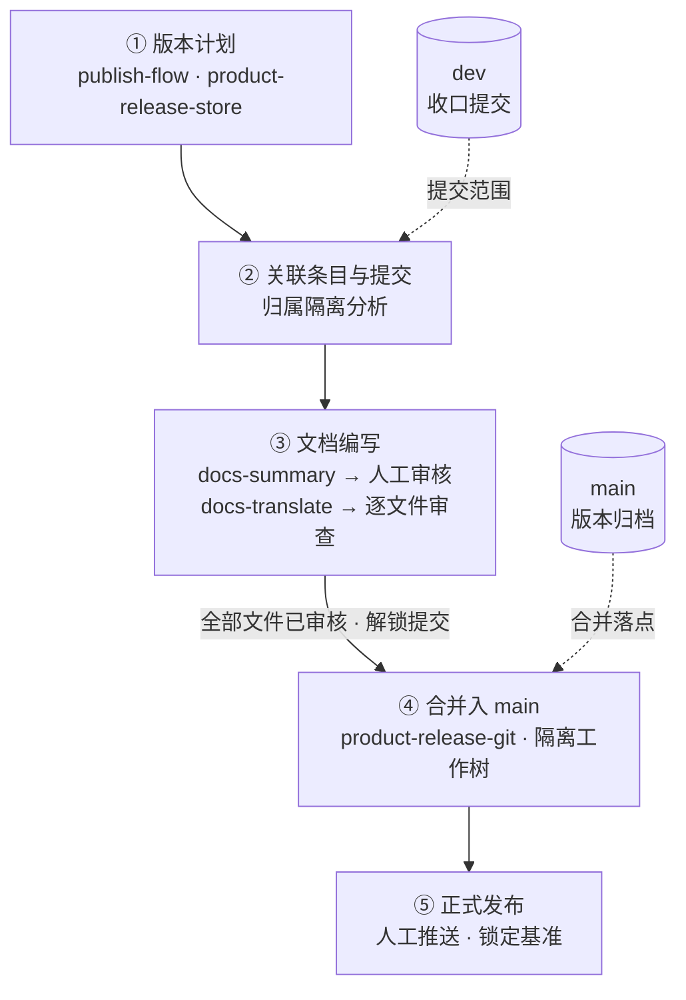
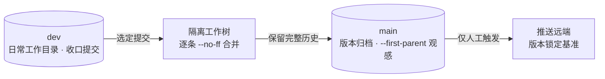

# Design Overview

## User Pain Points

As large AI models grow ever more powerful, more and more people are building products through AI Agents. I am no exception: I use Codex and Zcode daily.

But today's AI Agents all share a common flaw: their chat session lists are designed so messily that the pain becomes immediately obvious once you have added more than 10 sessions.

At the root of it, these Agents are more like chat tools than product development tools.

Since the vendors are not up to it, I will do it myself.

## Design Approach

To standardize product development, the key is to do three kinds of management well: "requirement management," "release management," and "quality management."

Requirement management turns ideas into implementable code; release management turns code into a distributable product. Quality management is the backstop for it all.

### Requirement Management

There are many mature requirement management tools on the market, but those are tools for old-school programming. In today's Vibe Coding era, requirement management needs AI Agents to deliver a more efficient and more stable requirement development process — especially for a one-person company.

#### Design Principles

- **Human in the loop**: Humans make decisions such as acceptance, planning, and sign-off; AI Agents handle execution such as analysis, development, testing, and reporting. The board is the sole collaboration interface between the two sides, and item states are moved by the system, not by verbal agreements.
- **Hard constraints over conventions**: The item state machine is managed by the system (the Agent's routine state operations are limited to claiming and reporting), source code changes are protected by Agent hook guards, and at development close-out the system commits automatically based on the snapshot taken at claim time. Rules are not written into documents for humans or AI to follow — they are written into the tools and enforced.
- **Local first**: It runs with one Node process and one Git repository — no external services, no account system. Data lives on your own machine and can be backed up, migrated, and audited at any time.
- **Simplicity above all**: In the old-school programming era, multi-branch parallel development was a hard choice that introduced complexity. In the one-person company era, two branches are enough: a dev branch develops requirements in sequence, and a main branch archives release versions.
- **Perpetual memory**: Every requirement and Bug item is a document directory, every close-out is a Git commit, and every version is grounded in commits. When something goes wrong, you can trace it layer by layer through items, commits, and version plans. As long as an item number is given, an Agent can quickly recover past "memory" — whether in a brand-new session or in multi-Agent collaboration.

#### Architecture Design

- **Entry layer**: The browser board (a native single-page application) and the CLI share the same services and data.
- **Service layer**: `scripts/server.mjs` implements a zero-dependency local service with Node's built-in http module (default port 8888, adjustable via `ATB_PORT` / `ATB_HOST`), exposing a JSON API and static assets.
- **Business layer**: `scripts/lib/` is split by domain — items and the state machine (core), claiming and automatic close-out (commit-store), the release pipeline (publish-flow), document summarization and translation (docs-summary / docs-translate), blocked decisions (hold-*), the command registry (cli-registry), and more.
- **Storage layer**: Item documents live in `agent-team-board/data/` (managed by Git), and runtime state lives in `agent-team-board/runtime/` (local only). The former is the joint product of humans and Agents; the latter is the state ledger of the running system.
- **Cross-cutting guard**: Hooks route the Agent host's write operations to `scripts/state-guard.mjs`, which intercepts unauthorized writes when no valid lock is held.

#### AI Collaboration Pipeline Design

Two parallel queues, both dispatched by "copying the prompt into an Agent session" — the board does not run models directly; the prompt is the contract between the board and the Agent session:

- **AI analysis**: For accepted items, it completes the description documents and acceptance criteria; when a UI is involved, it produces an interactive HTML demo. Once the results are confirmed, the item can automatically move into planning (configurable; manual by default).
- **AI development**: For planned items, the main session dispatches subagents via prompts to process items one by one through "claim → test first → implement → report", with automatic commits at close-out.
- **Human intervention points** are unified as "pending human confirmation": blocked declarations, doubtful attribution of automatic commits, and AI analysis confirmation all resume after the decision is recorded on the board.
- The global task view aggregates active tasks across projects; the execution ledger is kept only on the local machine.

Using prompts — rather than an SDK or CLI — to run models directly in the board is a trade-off with several benefits:

1. It works with every Agent, because not all Agents provide a CLI or SDK.
2. It does not violate vendors' Coding Plan terms of use. Vendor agreements typically require that a Coding Plan be used through the client, while SDK usage must go through the API on a pay-as-you-go basis. The costs of the two are not in the same order of magnitude.
3. It does not waste the free quota vendors give away. As is well known, using Zhipu models in the Zcode desktop client comes with an extra 50% quota. To promote their clients, vendors are bound to offer better deals than API billing — and quota is the best deal there is. Look at how even Tibo is called the god of resets, and you will understand that in this world, quota is king — that is simply a law.

So I chose prompts, at the cost of a little repetitive copy-and-paste work.

#### Markdown + Git as the Storage Architecture

This product stores task data as Markdown files managed by Git, without introducing a database:

- **Humans and Agents share the same medium**. Agents read and write plain text natively; Markdown needs no drivers, connection strings, or query layer. Humans can view and modify it with any editor, and AI sessions and the board see the same data.
- **Version history and auditing come for free**. Git naturally records who changed what and when; close-out commits are made automatically per item, so change attribution stays clear, and release documents and version plans can be verified against real commits.
- **Zero deployment, zero operations**. No service process to start, no schema to migrate, no separate backup strategy to maintain — `git clone` gives you all the data, and `atb rebuild` can even rebuild runtime state from Git history.
- **The diff is the review interface**. Every change to an item document is readable, reviewable, and revertible; both humans and Agents can read the diff directly to complete their confirmation.
- **Data and code share a lifecycle**. Item descriptions, designs, and reports ship with the repository; new members get the full context upon cloning, without depending on a database instance on any particular machine.

This trade-off also draws a boundary: Markdown + Git does not pursue high-concurrency writes, complex queries, or massive data — a task board needs none of that. Runtime state that requires transactional guarantees (state, locks, settings, the execution ledger) is stored as JSON in `agent-team-board/runtime/`, kept local only and never committed to Git — "documents go into Git, runtime state stays local" is the core layering of this storage design.

## Release Management

The core of a version release is to set the scope, write the documents, and lock the branch.

1. With the scope set, you know what to write into the documents.
2. With the documents written, users know how to use your product.
3. With the branch locked, the version stays stable.

That is why the release board iterates on features in five steps: **version planning → linking items and commits → document writing → merging into main → official release**.

By design, the five steps form a pipeline of decreasing reversibility: the earlier a step, the easier to change; the later, the more irreversible. Decisions converge in this order, and the sequence must not be inverted.

**Scope is defined by commits, not by prose**. What a version contains is determined by the associated close-out commits, not by requirement descriptions or whatever happens to exist on the dev branch. After multiple items close out in parallel, "which commits belong to this version" is the real challenge of releasing; attribution isolation analysis verifies commit by commit before merging: independent changes can be released on their own, unselected dependencies can be filled in with one click, and shared commits already in main are not misjudged as mixed commits.

**Documents are written before the merge, based on the scope**. Document writing happens before the merge and follows the already-determined commit scope — documents patched together after release inevitably drift from the code. The division of labor across the two stages (AI summarization → per-file human review → AI translation → per-file review) is that AI produces and humans gatekeep; committing is unlocked only once all files have passed review, and unreviewed content does not go out the door (as of BUG-20260926-002, the overall-review completion confirmation is no longer used); capabilities that have been reverted or whose entry points are hidden are documented as they actually are, not as planned.

**Merges preserve history; releases do not disturb development**. Items are merged one by one with --no-ff: merge nodes make version boundaries visible in history; rebase is not used, so the hashes and attribution chains of close-out commits stay stable; merges happen in an isolated worktree, so day-to-day development on dev is never interrupted by a release. main is browsed with --first-parent, so it always reads as one clean line of versions.

**The push is the human's final gate**. Pushing main is irreversible, so it is triggered only by a human and never enters any automated flow; once the push completes, the baseline is locked and the version can no longer be merged into or refined — immutability guarantees the certainty of "released."

#### Technical Design

The release capability is carried by three parts: the version record `product-release-store` carries the five-step stage gates and is the single source of truth; document writing advances in stages through two independent stores, `docs-summary-store` and `docs-translate-store`, each with its own lock; Git operations are consolidated into `product-release-git`, which executes inside an isolated worktree.

- The version record advances as one: planning, linked commits, and document-stage progress all live in the same version record, so at any moment it can answer "how far this version has progressed."
- A state machine for the document stages: summarization, review, and translation are unlocked stage by stage, and document commits are allowed only once all files have passed review (as of BUG-20260926-002, there is no overall-review completion step).

Branch and merge model: a release never touches dev's working directory, and main is advanced only inside an isolated worktree.

- Item-by-item --no-ff: one merge node per item, version boundaries visible in history, per-item attribution directly traceable — no need to untangle mixed commits after the fact.
- dev and main have closed responsibilities: dev only takes in development and never releases; main only releases and is never developed on; pushing main exists only through the single channel of the release process.

## Quality Management

Quality management is not a pre-release checking action; it is a constraint embedded at the entrance of every process. At its core is the TDD philosophy: tests first, test cases as the specification, and rules written into the tools and enforced.

- **Tests first**: For every item, tests are written first and run red; they run green after implementation. Test files are named after item numbers (e.g., bug-20260922-001.test.mjs), so any requirement or defect can be traced directly to its test cases.
- **Regression baseline**: Before delivery, the full npm test run must pass; existing behavior is pinned down by test cases, and whether a change breaks historical capability is answered by the full test run.
- **The state machine as backstop**: Process correctness is itself quality. The Agent's routine state operations are only claim and report; acceptance, planning, and confirming completion are reserved for humans, and an item does not count as done without acceptance.
- **Guard interception**: PreToolUse hooks intercept direct writes to state files, source code changes without a lock, and non-compliant commits; the file-edit and Bash channels are held to the same standard — not relying on self-discipline, but on deterministic interception.
- **Attributable commits**: Commit subjects are required to carry the item number (validated by commit-store); close-outs are attributed by the snapshot taken at claim time, so every change can be traced back to its item.

[返回 README](./README_en.md) · [更新日志](./CHANGELOG_en.md) · [功能说明](./FEATURES_en.md)
