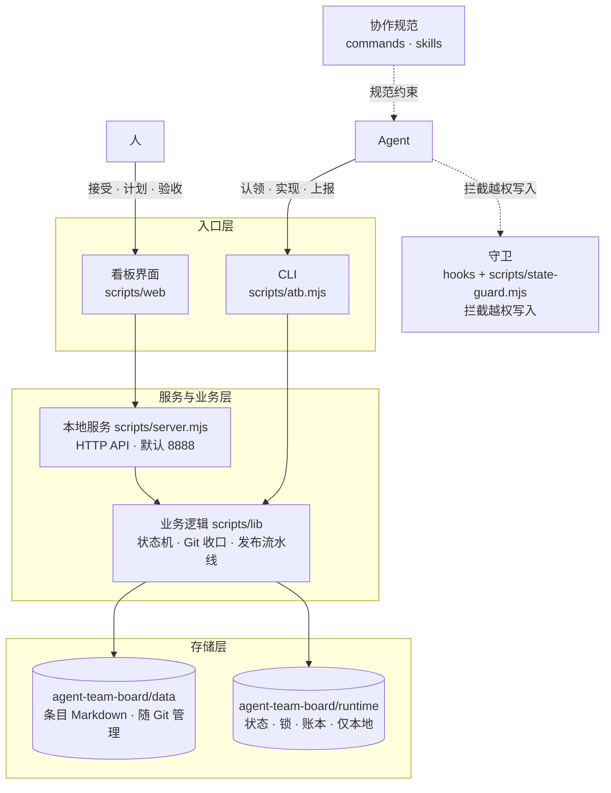
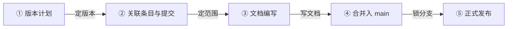
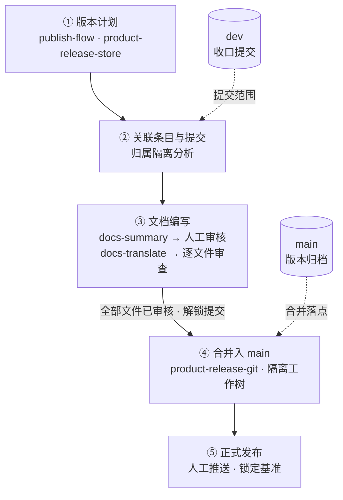
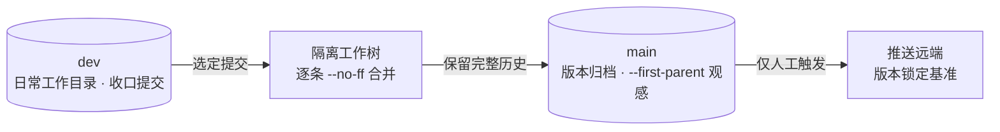

# Design Notes

## User Pain Points

As large AI models grow ever more capable, more and more people build products with AI Agents. I am no exception — I use Codex and Zcode every day.

But today's AI Agents all share a common flaw: the chaotic design of their chat session lists becomes painfully obvious the moment you have added more than ten sessions.

At their core, these Agents are more like chat tools than product development tools.

Since the vendors are not stepping up, I'll build it myself.

## Design Approach

To standardize product development, the key is to manage three things well: "requirement management", "release management", and "quality management".

Requirement management turns ideas into code that can actually land; release management turns code into products that can be distributed. Quality management is the safety net beneath it all.

### Requirement Management

The market offers many mature requirement management tools, but they were built for old-school programming. In today's era of Vibe Coding, requirement management needs AI Agents to deliver a more efficient and more stable requirement development flow — especially for a "one-person company".

#### Design Principles

- **Human in the loop**: Humans own the decisions — accept, plan, and sign off on acceptance; AI Agents own the execution — analyze, develop, test, and report. The board is the single collaboration interface between the two; states move through the system, not through verbal agreements.
- **Hard constraints over conventions**: The item state machine is managed by the system (the Agent's routine state operations are only claim and report), source code changes are protected by Agent hook guards, and development closures are committed automatically by the system based on the snapshot taken at claim time. Rules are not written into documents for humans or AI to follow — they are built into the tooling and enforced.
- **Local-first**: One Node process plus one Git repository is all it takes to run — no external services, no account system. Data lives on your own machine, ready to back up, migrate, and audit at any time.
- **Simplicity above all**: In the old-school programming era, multi-branch parallel development was a hard choice that invited complexity. In the "one-person company" era, two branches are enough: a dev branch handles sequential requirement development, and the main branch archives released versions.
- **Lasting memory**: Every requirement and bug item is a document directory, every closure is a Git commit, and every release is grounded in commits. When something goes wrong, you can trace it layer by layer through items, commits, and release plans. As long as an item ID is given, an Agent can quickly recover its former "memory" — whether in a brand-new session or in multi-Agent collaboration.

#### Architecture

- **Entry layer**: The browser board (a native single-page application) and the CLI share the same services and data.
- **Service layer**: `scripts/server.mjs` implements a zero-dependency local service with Node's built-in http module (default port 8888, adjustable via `ATB_PORT` / `ATB_HOST`), exposing a JSON API and static assets.
- **Business layer**: `scripts/lib/` is split by domain — items and the state machine (core), claiming and automatic closure (commit-store), the release pipeline (publish-flow), document summarization and translation (docs-summary / docs-translate), hold decisions (hold-*), the command registry (cli-registry), and more.
- **Storage layer**: Item documents live in `agent-team-board/data/` (managed by Git), while runtime state lives in `agent-team-board/runtime/` (local only). The former is the product of human–Agent collaboration; the latter is the state ledger of the running system.
- **Cross-cutting guard**: Hooks route write operations from the Agent host to `scripts/state-guard.mjs`, which blocks unauthorized writes when there is no valid lock.

#### AI Collaboration Pipeline Design

Two parallel queues, both dispatched by copying a prompt into an Agent session — the board does not run models directly; the prompt is the contract between the board and the Agent session:

- **AI analysis**: For accepted items, it completes the description documents and acceptance criteria; when a UI is involved, it produces an interactive HTML demo. Once the results are confirmed, items can move into the plan automatically (configurable, manual by default).
- **AI development**: For planned items, the main session dispatches subagents with prompts to process items one by one — claim → test first → implement → report — and the closure is committed automatically.
- **Human intervention points** are unified as "pending human confirmation": hold declarations, doubtful attribution of automatic commits, and AI analysis confirmation all resume on the board once the decision is filled in.
- The global task view aggregates active tasks across projects; the execution ledger is kept on the local machine only.

Choosing prompts — rather than an SDK or CLI — over running models directly in the board has several benefits:

1. It works with every Agent, since not all Agents provide a CLI or SDK.
2. It does not violate the vendors' Coding Plan terms of use. Vendor agreements usually require Coding Plans to be used through the client, while SDK usage must go through metered API billing. The costs of the two are not in the same league.
3. It does not waste the quota vendors give away. As is well known, using Zhipu models in the Zcode desktop client comes with an extra 50% quota. To promote their clients, vendors will always offer better deals than API billing — and quota is the best deal of all. Consider that Tibo is even called the god of resets: you can see that in this world, quota is king — that is simply a law of nature.

So I chose prompts, at the cost of a bit of repetitive copy-paste work.

#### Markdown + Git as the Storage Architecture

This product stores task data as Markdown files managed by Git, without introducing a database:

- **Humans and Agents share the same medium**. Agents read and write plain text natively; Markdown needs no drivers, connection strings, or query layer. Humans can view and edit it directly in any editor, and AI sessions and the board see exactly the same data.
- **Version history and auditing come for free**. Git naturally records who changed what and when; development closures are committed automatically per item, so the attribution of changes is clear, and release documents and release plans can be verified against real commits.
- **Zero deployment, zero operations**. No service process to start, no schema to migrate, no separate backup strategy to maintain — `git clone` gives you all the data, and `atb rebuild` can even rebuild the runtime state from Git history.
- **The diff is the review interface**. Every change to item documents is readable, reviewable, and revertible; both humans and Agents can complete confirmation by reading the diff directly.
- **Data and code share a lifecycle**. Item descriptions, designs, and reports ship with the repository; new members get the full context on clone, with no dependency on a database instance on some particular machine.

This trade-off also draws the boundary: Markdown + Git does not aim at high-concurrency writes, complex queries, or massive data — a task board needs none of those. Runtime state that requires transactional guarantees (statuses, locks, settings, the execution ledger) is stored as JSON in `agent-team-board/runtime/`, kept local only and never committed to Git — "documents go into Git, runtime state stays local" is the core layering of this storage design.

## Release Management

The core of a version release is to define the scope, write the documents, and lock the branches.

1. Define the scope, and you know what to write in the documents.
2. Write the documents, and users know how to use your product.
3. Lock the branches, and the release stays stable.

That is why the release board iterates on features in five steps: **release plan → link items and commits → document writing → merge into main → official release**.

By design, the five steps form a pipeline of decreasing reversibility: the earlier the stage, the easier it is to change; the later, the more irreversible. Decisions converge in this order, and the order cannot be swapped.

**Scope is defined by commits, not by words**. What a version contains is determined by the linked closure commits, not by requirement descriptions or whatever happens to exist on the dev branch. After multiple items close in parallel, "which commits belong to this release" is the real challenge of releasing; attribution isolation analysis verifies commit by commit before merging: independent changes can ship alone, missing dependencies can be filled in with one click, and shared commits already in main are not misjudged as mixed commits.

**Documents are written before the merge, based on the scope**. Document writing is placed before the merge and follows the confirmed commit scope — documents patched together after a release inevitably drift from the code. In the two-phase flow (AI summary → per-file human review → AI translation → per-file review), the division of labor is AI produces, humans gate: commits stay locked until every file has passed review, and unreviewed content never ships (as of BUG-20260926-002 there is no overall review-completion confirmation); capabilities that have been reverted or had their entry points hidden are documented according to their actual state, not according to plan.

**Merges preserve history; releases do not disturb development**. Items are merged one by one with --no-ff: merge nodes make version boundaries visible in history; rebase is never used, so closure commit hashes and attribution chains stay stable; merges happen in an isolated worktree, so everyday development on dev is never interrupted by a release. Browsed with --first-parent, main always reads as a clean release line.

**Pushing is the human's final gate**. Pushing main is irreversible, so it is triggered only by a human and never enters any automated flow; once the push completes, the baseline is locked and the release can no longer be merged into or refined — immutability is what makes "released" a certainty.

#### Technical Approach

The release capability rests on three pieces: the release record `product-release-store` carries the five-step stage gates and is the single source of truth; document writing advances in phases through two independent stores, `docs-summary-store` and `docs-translate-store`, each with its own lock; and Git operations are consolidated into `product-release-git`, executed inside an isolated worktree.

- The release record advances as one: planning, linked commits, and document-phase progress all live in the same release record, so at any moment it can answer "how far along is this release".
- A state machine for the document phases: summary, review, and translation unlock stage by stage, and document commits are only released once every file has passed review (as of BUG-20260926-002 there is no overall review-completion step).

Branch and merge model: a release never touches the dev working directory, and main is advanced only within an isolated worktree.

- Item-by-item --no-ff merges: one merge node per item keeps version boundaries visible in history and makes each item's attribution directly traceable — there is no need to untangle mixed commits after the fact.
- dev and main have closed responsibilities: dev takes in development but never releases; main releases but hosts no development; pushing main exists only through the single channel of the release flow.

## Quality Management

Quality management is not a pre-release checkpoint; it is a constraint embedded at the entrance of every flow. At its core is the TDD philosophy: tests first, test cases as the spec, and rules built into the tooling and enforced.

- **Tests first**: Every item gets its tests written first and run to red before implementation, then to green afterwards; test files are named after the item ID (e.g. bug-20260922-001.test.mjs), so any requirement or defect can be traced straight back to its test cases.
- **Regression baseline**: The full npm test suite must pass before delivery; existing behavior is pinned by test cases, and whether a change breaks historical capability is answered by the full suite.
- **The state machine as the backstop**: Process correctness is itself quality. The Agent's routine state operations are only claim and report; accept, plan, and confirm-done are human-only, and an item is never done without acceptance.
- **Guard interception**: PreToolUse hooks block direct writes to status files, block source code changes without a lock, and block non-compliant commits; the file-edit and Bash channels are held to the same standard — not relying on self-discipline, but on deterministic interception.
- **Attributable commits**: Commit subjects must carry the item ID (validated by commit-store), closures attribute changes by the claim-time snapshot, and every change traces back to its item.

[返回 README](./README_en.md) · [更新日志](./CHANGELOG_en.md) · [功能说明](./FEATURES_en.md)
