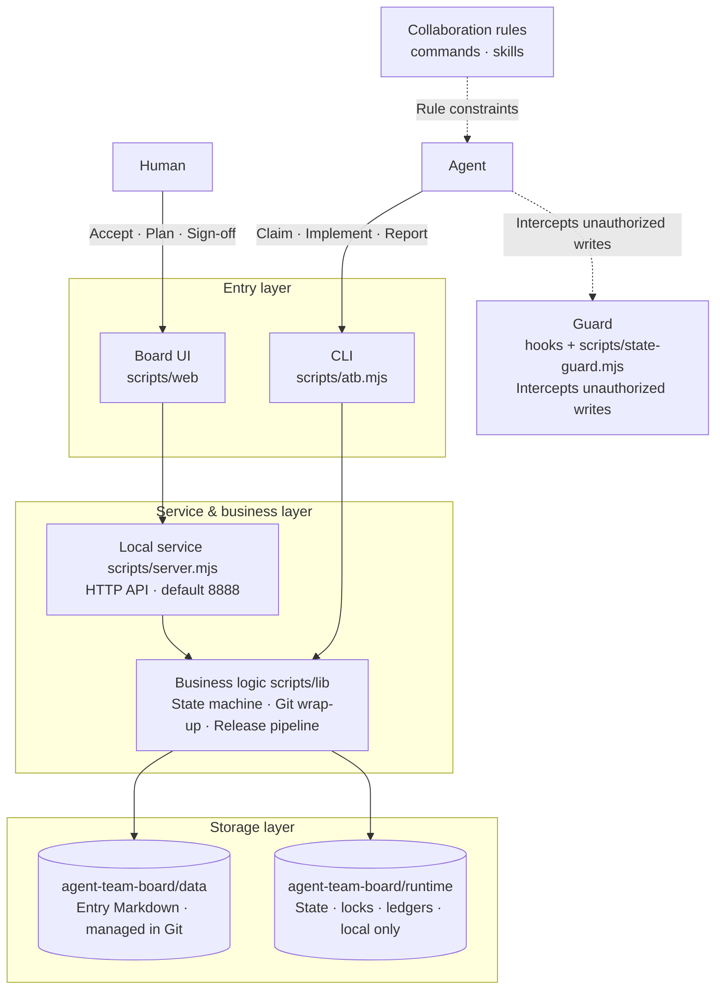
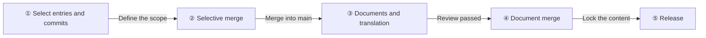
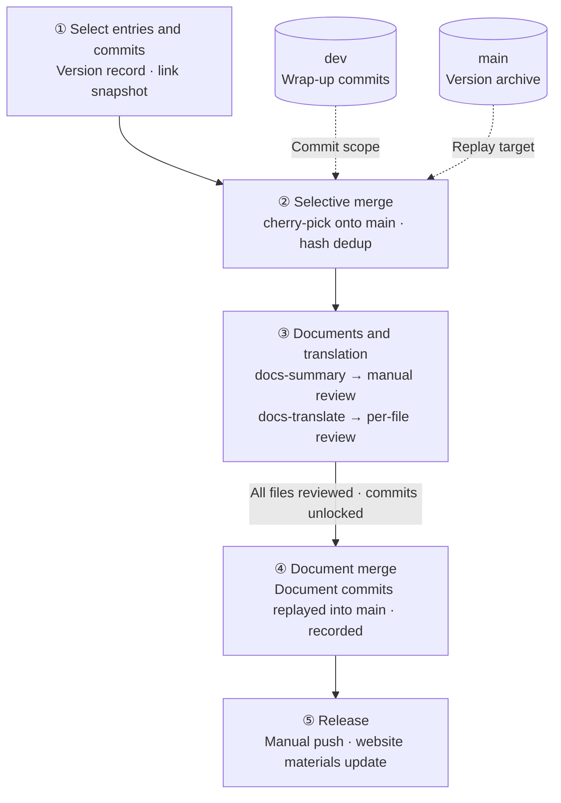
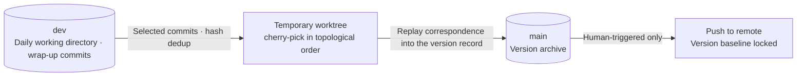

# Design Notes

[中文](./DESIGN.md) | [English](./DESIGN_en.md)

## User Pain Points

As large AI models grow ever more capable, more and more people are building products with AI agents. I am no exception. My daily drivers are Codex and Zcode.

But today's AI agents all share one common ailment: the mess of their chat session list design is a problem you immediately and deeply feel once you have more than 10 sessions.

At the end of the day, these agents are more like chat tools than product development tools.

Since the vendors aren't stepping up, I'll just do it myself.

## Design Philosophy

Standardizing product development comes down to getting three disciplines right: "requirements management", "release management", and "quality management".

Requirements management turns ideas into shippable code, and release management turns code into a distributable product. Quality management is the safety net under everything.

### Requirements Management

There are plenty of mature requirements management tools on the market, but they were all built for old-school programming. In today's world of Vibe Coding, requirements management needs AI agents to deliver a more efficient, more stable requirements development workflow—especially for a "one-person company".

#### Design Principles

- **Human in the loop**: People handle the decisions—accepting, planning, and sign-off—while AI agents handle the execution—analysis, development, testing, and reporting. The board is the only collaboration interface between the two sides, and state transitions are made by the system, not by verbal agreement.
- **Hard constraints over conventions**: The entry state machine is managed by the system (an agent's routine state operations are only claim and report), source code changes are protected by agent hook guards, and the development wrap-up is committed automatically by the system against the snapshot taken at claim time. Rules are not written into documents waiting for humans or AI to obey—they are written into the tooling and enforced.
- **Local-first**: One Node process plus one Git repository is all it takes to run—no external services, no account system. Data stays on your own machine, ready to back up, migrate, or audit at any time.
- **Simplicity above everything**: In the old-school programming era, parallel development across many branches was a hard choice that invited complexity. In the era of the one-person company, two branches are enough: a single dev branch develops requirements in order, and the main branch archives released versions.
- **Persistent memory**: Every requirement and bug entry is a document directory, every wrap-up is a Git commit, and every version is grounded in its commits. When something goes wrong, you can trace back layer by layer through entries, commits, and version plans. Just name an entry ID, and an agent can quickly recover its "memory"—whether in a brand-new session or across multiple collaborating agents.

#### Architecture

- **Entry layer**: The browser board (a native single-page application) and the CLI share the same service and data.
- **Service layer**: `scripts/server.mjs` implements a zero-dependency local service on Node's built-in http (default port 8888, adjustable via `ATB_PORT` / `ATB_HOST`), serving a JSON API and static assets.
- **Business layer**: `scripts/lib/` is split by domain—entries and the state machine (core), claim and automatic wrap-up (commit-store), the release pipeline (publish-flow), document summarization and translation (docs-summary / docs-translate), blocked-decision handling (hold-*), the command registry (cli-registry), and more.
- **Storage layer**: Entry documents live in `agent-team-board/data/` (managed in Git), while runtime state lives in `agent-team-board/runtime/` (local only). The former is the collaborative output of humans and agents; the latter is the state ledger the system runs on.
- **Cross-cutting guard**: Hooks route the agent host's write operations into `scripts/state-guard.mjs`, which intercepts unauthorized writes when no valid lock is held.

#### AI Collaboration Pipeline Design

Two parallel queues, both dispatched by "copying a prompt into an agent session"—the board never runs models directly; the prompt is the contract between the board and the agent session:

- **AI analysis**: For accepted entries, it completes the description document and acceptance criteria; when a UI is involved, it produces an interactive HTML demo. Once the results are confirmed, the entry can move into planning automatically (configurable; manual by default).
- **AI development**: For planned entries, the main session dispatches subagents per the prompt, each executing one entry through "claim → test-first → implement → report", with the wrap-up committed automatically.
- **Human intervention points** are unified as "pending manual confirmation": blocked declarations, doubtful attribution of automatic commits, and AI analysis confirmations all resume once the decision is supplied on the board.
- The global task view aggregates active tasks across projects; execution ledgers are kept on the local machine only.

Using prompts instead of an SDK or CLI to run models directly inside the board is a trade-off with several benefits:

1. It works with every agent, because not every agent offers a CLI or an SDK.
2. It does not violate the vendors' Coding Plan terms. Vendor agreements usually require Coding Plans to be used through the client, while SDKs must go through pay-as-you-go API billing. The two cost models are not in the same order of magnitude.
3. It does not waste the quota vendors give away. As everyone knows, using Zhipu models in the Zcode desktop client comes with an extra 50% quota. To promote their clients, vendors always offer better deals than API billing—and quota is the best deal of all. Just look at Tibo, known as the god of resets, and you will understand that in this world, "quota is king" is the law.

So I chose prompts, at the cost of a little repetitive copy-paste work.

#### Markdown + Git as the Storage Architecture

This product stores task data as Markdown files and manages them with Git, without introducing a database:

- **Humans and agents share one medium**. Agents natively read and write plain text; Markdown needs no drivers, connection strings, or query layers. Humans can view and edit it in any editor, and the AI session and the board see the very same data.
- **Version history and audit come for free**. Git naturally records who changed what and when; development wrap-ups commit automatically per entry, change attribution stays clear, and release documents and version plans can be verified against real commits.
- **Zero deployment, zero operations**. No service process to start, no schema to migrate, no separate backup strategy to maintain—`git clone` gets you all the data, and `atb rebuild` can even rebuild runtime state from Git history.
- **The diff is the review interface**. Every change to an entry document is readable, reviewable, and revertible; humans and agents alike can complete confirmation by reading the diff directly.
- **Data and code share one lifecycle**. Entry descriptions, designs, and reports ship with the repository; a new member gets the full context just by cloning it, with no dependence on a database instance living on some particular machine.

This trade-off also draws a boundary: Markdown + Git does not chase high-concurrency writes, complex queries, or massive data volumes—a task board does not need them. Runtime state that requires transactional guarantees (status, locks, settings, execution ledgers) is stored as JSON in `agent-team-board/runtime/`, kept local only and never committed to Git—"documents go into Git, runtime state stays local" is the core layering of this storage design.

## Release Management

The core of releasing a version is defining the scope, writing the documents, and locking the branch.

1. Define the scope, and you know what the documents should say.
2. Write the documents well, and you know how users will use your product.
3. Lock the branch, and the version stays stable.

So on the release board, feature iteration follows five steps: **select entries and commits → selective merge → documents and translation → document merge → release**.

By design, the five steps form a pipeline of "decreasing reversibility": the earlier a step, the easier it is to change; the later a step, the more irreversible it is. Decisions converge along this order, and the order must not be flipped.

**Scope is defined by commits, not by words**. What a version contains is determined by the selected wrap-up commits, not by requirement descriptions or by whatever happens to exist on the dev branch. Checking an entry automatically links all commits that belong to it; entries and commits stand in a many-to-many relationship. The selected commits are deduplicated by hash, so a commit linked to multiple entries is merged in only once. Unselected ancestors are no longer treated as functional dependencies that must be filled in—they serve as read-only reference only; commits with no effect on what lands in main (such as release document commits from older versions) are explicitly marked so they create no noise.

**Documents are written after the merge, grounded in what actually landed**. First the selective merge, then the documents, written from what actually landed in this version—documents describe the changes that are definitely going into main, not the planned ones. The default language is first summarized by AI and reviewed file by file by a human (optionally aided by AI proofreading); the other languages are translated by AI and then reviewed file by file; commits unlock only after every file passes review (since BUG-20260926-002 there is no longer an overall review-completion confirmation); when a default-language document is modified, its translations automatically go back to pending translation. Capabilities that were rolled back or whose entry points are hidden are written up as they actually are, not as planned.

**Merging replays the selection, and releasing never disturbs development**. The selected commits are cherry-picked onto main one by one in Git topological order (`-x` preserves tracing back to the original commits), and the before-and-after correspondence of the replay is recorded in the version plan; conflicts show the specific commits and files, execution can continue once they are resolved, and commits already applied successfully are not repeated. The merge happens in a temporary worktree, so daily development on dev is never interrupted by a release.

**Pushing is the final human gate**. Pushing becomes possible only after the document merge has been recorded; pushing main cannot be undone, so it is triggered only by a human and never enters any automated flow. A release involves two manual actions—pushing to the remote and updating the website materials—each verified separately: merged locally does not mean published to the remote, nor does it mean the website has been updated. Once the push completes, the baseline is locked, and the version can no longer be merged into or refined—immutability is what guarantees the certainty of "released".

#### Technical Design

Release capabilities are carried by three components: the version record `product-release-store` carries the five-step stage gates and is the single source of truth; document writing is advanced in phases by two independent stores, `docs-summary-store` and `docs-translate-store`, each with its own lock; Git operations converge into `product-release-git` and `build-git`, executed inside a temporary worktree.

- Unified progress in the version record: the plan, the entry-and-commit link snapshot, merge results, document-phase progress, and document-merge evidence all live in the same version record, which can answer "which step is this version at" at any moment; merged facts are recorded at multiple layers, so plan edits cannot silently erase them.
- A state machine for the document phase: summary, review, and translation unlock segment by segment, and document commits are allowed only after every file passes review (no overall review-completion step since BUG-20260926-002); documents are committed separately, then replayed into main and recorded by the "document merge" step; pushing is gated on the document merge being recorded.

The branch and merge model: a release never touches dev's working directory, and main is advanced only inside a temporary worktree.

- Replay by selection: what enters the version is "the complete changes of the selected commits", decoupled from their position on dev; shared commits are replayed only once, the correspondence between original commits and their replays on main is traceable, and the attribution of any single commit can be followed directly.
- dev and main keep closed responsibilities: dev only takes in development and never releases; main only releases and never develops; pushing main exists on exactly one channel—the release flow.

## Quality Management

Quality management is not an inspection performed right before a release; it is a constraint embedded at the entrance of every workflow. At its core is the TDD philosophy: tests first, test cases as the specification, and rules written into the tooling so they are enforced.

- **Tests first**: Every entry gets its tests written first and failing red, then passing green after implementation; test files are named after the entry ID (for example, bug-20260922-001.test.mjs), so every requirement or defect traces directly to its test cases.
- **Regression baseline**: Before delivery, the full npm test suite must pass; existing behavior is pinned down by test cases, and whether a change breaks past capabilities is answered by the full test run.
- **State machine as the safety net**: A correct process is itself quality. An agent's routine state operations are only claim and report; accepting, planning, and confirming completion are human-only, and an entry does not count as done without acceptance.
- **Guard interception**: PreToolUse hooks intercept direct writes to state files, source code changes without a lock, and non-compliant commits; the file-editing and Bash channels are held to the same standard—not self-discipline, but deterministic interception.
- **Attributable commits**: Commit subjects must carry the entry ID (validated by commit-store), wrap-ups are attributed against the snapshot taken at claim time, and every change traces back to its entry.

[Back to README](./README_en.md) · [Changelog](./CHANGELOG_en.md) · [Features](./FEATURES_en.md)
