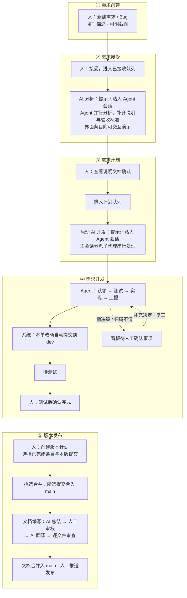

# Agent Team Board（智能体团队看板）

[中文](./README.md) | [English](./README_en.md)

## 项目介绍

Agent Team Board（ATB，智能体团队看板）把需求、Bug、AI 分析与开发、版本发布放进同一个本地看板：人负责规划和验收需求，并启动 AI 队列让 AI 自动取单进行分析、开发和提交进 Git。所有的需求文档均使用 Git 进行管理，全程留痕、可追溯。

#### 谁适合用

任何用 AI Agent 做真实开发的人。当你发现「和 Agent 聊出来的活」需要变成正式流程——要登记需求、要排期、要验收、要留痕、要发版——就是用它的时候。它适合独立开发者，也适合小团队；被管理的项目不限语言与领域，看板本身只依赖本机的 Node.js 和 Git，不连云服务，数据不出你的机器。

项目开源，欢迎提问、报告缺陷（Issues）、提交代码（Pull Request）和新功能建议。

使用 Agent 开发本产品，先读 [AGENTS.md](./AGENTS.md)；使用本产品管理其他项目，先读 [任务管理 skill](./skills/agent-team-board/SKILL.md)。

## 版本说明

当前版本号 1.0.0，是首个基线版本。

## 开始使用

本项目是为 Vibe Coding 而开发的，因此需要在各 Agent 中安装插件，以便扩展 Agent 的能力。

#### 安装 Agent 插件

本项目同时是一个可装入 Agent 宿主的插件，提供 `/req`、`/bug`、`/dev`、`/board` 等登记与开发命令、任务管理 skill，以及拦截越权写入的 PreToolUse 钩子守卫。按宿主的插件机制加载本仓库即可：Zcode 与 Codex 的插件清单分别为 `.zcode-plugin/plugin.json` 与 `.codex-plugin/plugin.json`（slash 命令为 Zcode 专属，Codex 经 skills 与钩子使用）。

建议再安装终端短命令 `atb`，在仓库根目录执行：

```bash
node scripts/atb.mjs cli install
```

安装会在可写的 PATH 目录（按 `/usr/local/bin` → `~/.local/bin` → `~/bin` 顺序自动选择）创建指向 `bin/atb` 的符号链接；`atb cli status` 查看安装状态，`atb cli uninstall` 卸载。之后在任意目录都能使用 `atb`，在被管理的项目根目录执行 `atb init` 即完成接入，随后就可以在 Agent 会话中用上述命令登记需求、开发与查看看板。

#### 产品界面


目前版本主要通过浏览器使用。在根目录下执行以下命令即可打开 `http://127.0.0.1:8888`。

```bash
bin/atb serve --open
```

一个服务可管理多个本地项目；在看板中添加或切换项目，并为尚未接入的项目点击「初始化」。

#### 一次完整协作过程



## 文档

[更新日志](./CHANGELOG.md) · [功能说明](./FEATURES.md) · [设计文档](./DESIGN.md) · [AGENTS.md](./AGENTS.md)

## 开源协议

本项目基于 [MIT License](./LICENSE.md) 开源。
