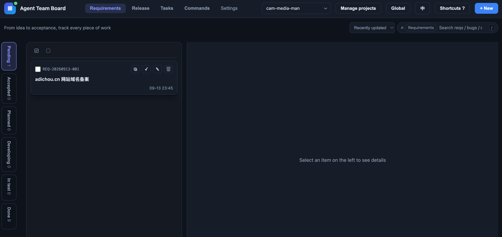
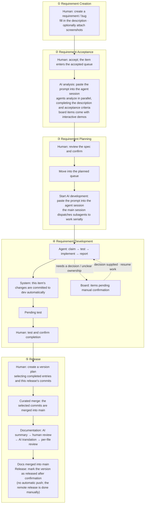

# Agent Team Board

[中文](./README.md) | [English](./README_en.md)

## Project Introduction

Agent Team Board (ATB) brings requirements, bugs, AI analysis and development, and release management together in one local board: humans handle planning and acceptance of requirements, then start an AI queue so agents automatically pick up items for analysis, development, and Git commits. All requirement documents are managed with Git, leaving a complete, traceable record of the whole process.

#### Who It's For

Anyone doing real development with AI agents. When work you shaped through conversations with an agent needs to become a formal process — registering requirements, scheduling, acceptance, record keeping, releasing — that's when this tool fits. It suits solo developers and small teams alike; the projects it manages can be in any language or domain. The board itself depends only on the local Node.js and Git on your machine, connects to no cloud service, and your data never leaves your machine.

The project is open source — questions, bug reports (Issues), code contributions (Pull Requests), and feature suggestions are all welcome.

If you use an agent to develop this product, read [AGENTS.md](./AGENTS_en.md) first; to use this product to manage other projects, start with the [task management skill](./skills/agent-team-board/SKILL.md).

## Version

The current version is 1.0.1, a fix-and-simplification patch for the release module: the release action is streamlined into "check → second confirmation → mark the version plan as released", and no longer performs remote pushes or website builds; projects with a master main branch are now supported; completed entries that have no associated commits yet can also be included in a version plan; and it fixes 4 defects, including the version status label and the timezone display of times in the interface. See the [Changelog](./CHANGELOG_en.md) for details.

## Getting Started

This project was built for Vibe Coding, so you need to install a plugin in each agent to extend the agent's capabilities.

#### Install the Agent Plugin

This project is also a plugin that can be loaded into an agent host, providing registration and development commands such as `/req`, `/bug`, `/dev`, and `/board`, a task management skill, and a PreToolUse hook guard that blocks unauthorized writes. Load this repository through your host's plugin mechanism: the plugin manifests for Zcode and Codex are `.zcode-plugin/plugin.json` and `.codex-plugin/plugin.json` respectively (slash commands are Zcode-only; on Codex it is used through skills and hooks).

We also recommend installing the `atb` terminal shortcut. From the repository root, run:

```bash
node scripts/atb.mjs cli install
```

The installer creates a symbolic link to `bin/atb` in the first writable PATH directory it finds (trying `/usr/local/bin` → `~/.local/bin` → `~/bin` in order); `atb cli status` shows the installation status, and `atb cli uninstall` removes it. After that, `atb` is available from any directory. Run `atb init` in the root of the project you want to manage to hook it up, and you can then register requirements, develop, and view the board with the commands above from your agent sessions.

#### Product Interface



The current version is used mainly through the browser. Run the following command from the repository root to open `http://127.0.0.1:8888`.

```bash
bin/atb serve --open
```

A single server can manage multiple local projects; add or switch projects in the board, and click "Initialize" for projects that have not been hooked up yet.

#### A Complete Collaboration Cycle



## Documentation

[Changelog](./CHANGELOG_en.md) · [Features](./FEATURES_en.md) · [Design](./DESIGN_en.md) · [AGENTS.md](./AGENTS_en.md)

## License

This project is open source under the [MIT License](./LICENSE.md).
