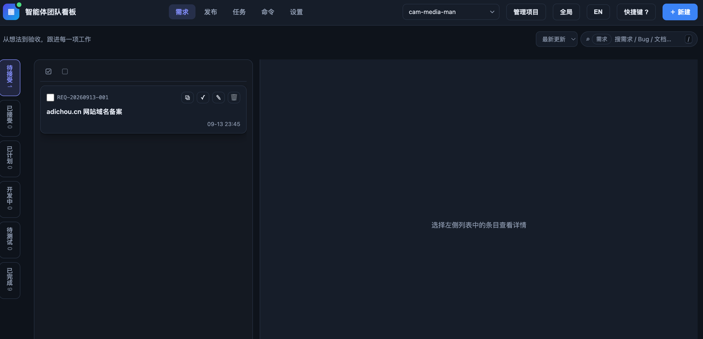
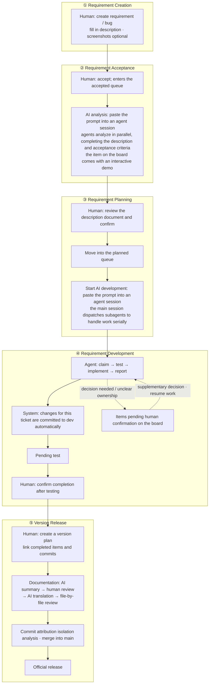

# Agent Team Board (AI Agent Team Kanban)

## Introduction

Agent Team Board (ATB, an AI agent team kanban) puts requirements, bugs, AI analysis and development, and version releases on one local board: humans plan and accept requirements, and start AI queues so that AI automatically picks up tickets for analysis, development, and committing into Git. All requirement documents are managed with Git, keeping a full record throughout the process so everything is traceable.

#### Who It Is For

Anyone doing real development with AI agents. When you find that the work "chatted out with an agent" needs to become a formal process — requirements to register, schedules to plan, results to accept, records to keep, releases to ship — that is when you use it. It suits independent developers as well as small teams; the projects under management are not limited by language or domain, and the board itself depends only on local Node.js and Git — it connects to no cloud services, and your data never leaves your machine.

The project is open source. Questions, bug reports (Issues), code contributions (Pull Requests), and suggestions for new features are all welcome.

To develop this product with agents, read [AGENTS.md](./AGENTS_en.md) first; to use this product to manage other projects, read the [task-management skill](./skills/agent-team-board/SKILL.md) first.

## Version Notes

The current version is 1.0.0, the first full-feature baseline version.

## Getting Started

This project was developed for Vibe Coding, so plugins need to be installed in each agent to extend the agents' capabilities.

#### Installing the Agent Plugin

This project is itself a plugin that can be loaded into an agent host. It provides registration and development commands such as `/req`, `/bug`, `/dev`, and `/board`, a task-management skill, and a PreToolUse hook guard that blocks unauthorized writes. Simply load this repository via the host's plugin mechanism: the plugin manifests for Zcode and Codex are `.zcode-plugin/plugin.json` and `.codex-plugin/plugin.json` respectively (slash commands are Zcode-only; Codex uses it through skills and hooks).

It is also recommended to install the terminal shorthand command `atb`; run the following in the repository root:

```bash
node scripts/atb.mjs cli install
```

The installation creates a symbolic link to `bin/atb` in a writable PATH directory (chosen automatically in the order `/usr/local/bin` → `~/.local/bin` → `~/bin`); `atb cli status` shows the installation status, and `atb cli uninstall` uninstalls it. Afterwards, `atb` is available from any directory; run `atb init` in the root directory of a project to onboard it, and you can then use the commands above in agent sessions to register requirements, develop, and view the board.

#### Product Interface



The current version is used mainly through a browser. Run the following command in the root directory to open `http://127.0.0.1:8888`.

```bash
bin/atb serve --open
```

One server can manage multiple local projects; add or switch projects on the board, and click "Initialize" for projects that have not yet been onboarded.

#### One Complete Collaboration Process



## Documentation

[更新日志](./CHANGELOG_en.md) · [功能说明](./FEATURES_en.md) · [设计文档](./DESIGN_en.md) · [AGENTS.md](./AGENTS_en.md)

## License

This project is open sourced under the [MIT License](./LICENSE.md).
