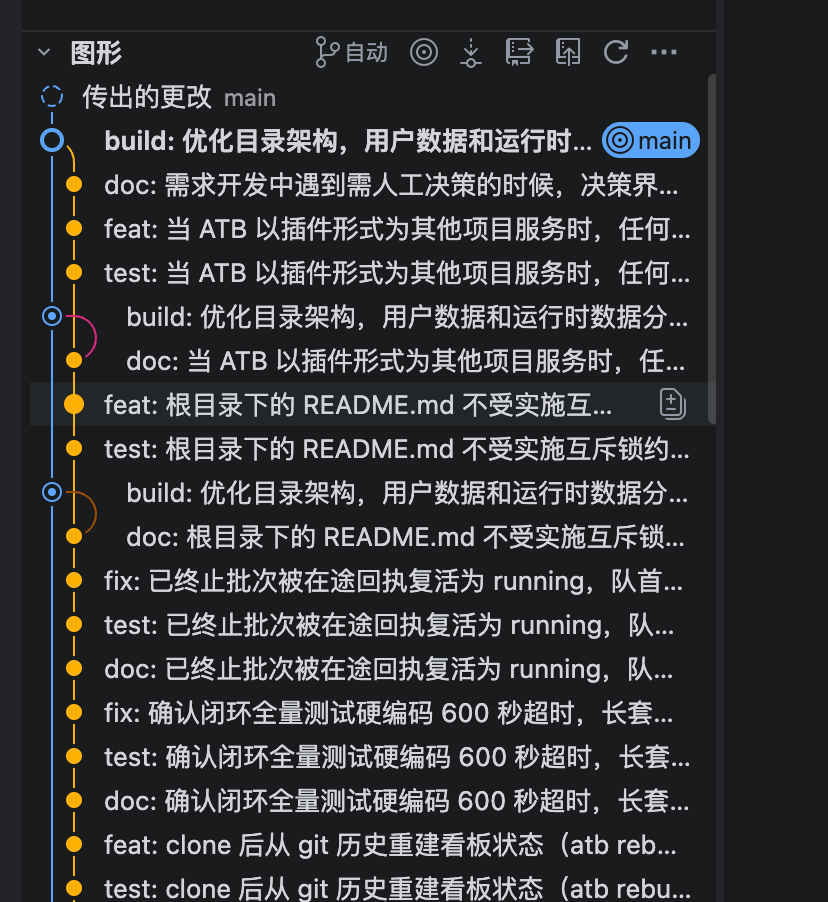

# BUG-20260920-002 main 分支的 git log 显示需要优化

- 状态：submitted（待人工接受）
- 归属：独立 Bug（引入来源见 design.md）
- 创建：2026-09-20T10:02:44.854Z

## 现象

用户报告（原文）：

1、要显示 dev 和 main 两条分支的提交历史
2、main 和 dev 的汇聚点要清晰和美观，请按截图实现

截图为 VS Code Git Graph 风格的提交图：main 与 dev 两条彩色轨道并行下行，各自的分支头带名称标签；dev 轨道经一条水平连线汇入 main 车道，汇聚处带「Merge-base」标注，更早的共享历史合并为单轨继续向下。

### 已核实的现状（代码事实）

问题出在「构建 → 分支浏览」右侧提交记录（含 REQ-20260920-001 引入的行内历史拓扑图）：

- **单支读取，看不到另一条分支**：`scripts/lib/build-git.mjs` 的 `branchLog` / `branchSearchLog` 执行 `git log <branch>`，只返回所选分支可达的提交。选中 main 时，dev 上尚未合并入 main 的提交完全不出现在列表与图形中，dev 分支头位置不可见。以本仓库实测（2026-09-20）：`git rev-list --count main..dev` = 11，即查看 main 时有 11 个 dev 提交缺席。
- **无法标注分支身份**：提交元数据格式为 `%H %h %an %aI %P %s`，不含任何引用 / 分支头信息（无 `--decorate` 或 refs 数据），前端无从得知某提交是 main 或 dev 的分支头，因此不能像截图那样给轨道加分支名标签。
- **轨道配色与分支无关**：`logGraph` 按行内槽位序号分配颜色类（lg-c0 / lg-c1 …），同一分支在不同页 / 不同搜索态下的颜色不稳定，两支并行时无法靠颜色区分 main 与 dev。
- **汇聚点无显式表达**：图形只画已加载提交的真实父子边，不计算也不标注 main 与 dev 的 merge-base（两支历史的汇合位置）；截图中的水平汇聚连线与「Merge-base」标注在现有实现中没有对应物。
- 用户实际使用的浏览器、运行版本与期望的配色 / 像素级样式细节：待确认（以截图风格「清晰、美观」为方向，具体视觉开发阶段定稿）。

## 复现步骤

前提：项目为 git 仓库，同时存在本地 `main` 与 `dev` 分支，且 dev 存在尚未合并入 main 的提交（本产品自身仓库即满足；任何经 `atb init` 初始化并正常收口过若干单的项目亦满足）。

1. 启动 Status Board（`node scripts/server.mjs`）并打开 Web 界面。
2. 切换到「构建」模块，顶部页签选「分支浏览」。
3. 在左侧分支列表「本地」分组点击 `main`，等待右侧「提交记录」加载完成。
4. 观察右侧列表与拓扑图。

实际结果（缺陷现状，可用 [ui-demo.html](./ui-demo.html) 的「缺陷现状」模式对照）：

- 列表只含 main 可达提交；dev 上未合并的提交（本仓库当前为 11 个）与 dev 分支头均不可见。
- 任何提交行都没有 main / dev 分支头标签，轨道颜色不对应分支身份。
- main 与 dev 两支历史的汇聚点（merge-base，本仓库实测为 86cc81d）没有任何图形或文字标注。

预期结果见下节。

## 期望行为

- 选中 main（对称地，选中 dev）查看提交记录时，提交历史同时呈现 **main 与 dev 两条分支**：两支提交的并集（等价于 `git log main dev` 的可达集合），dev 未合并提交与 dev 分支头可见。
- 两条轨道按**分支稳定配色**（main / dev 各一色，翻页 / 搜索后不跳变），**分支头带名称标签**（如截图顶部的 main / dev 标签）；无引用指向的历史轨道不编造分支名（沿用 REQ-20260920-001 口径）。
- **汇聚点清晰美观**：按截图风格，dev 轨道与 main 车道的汇合处以明确的连线与标注表达（含 merge-base 位置标识），两支从并行到汇合的结构一眼可辨；合并提交保留既有双圈节点与「合并 · N 父提交」标签。
- 保持只读语义：不切换工作区分支、不修改引用与文件；不新增 checkout / merge / rebase 等操作。
- 既有能力不回退：分页（20/50/100）、关键词搜索、刷新、加载 / 空 / 失败态与重试仍可用；涉及的新增界面文案中英文同步（BUG-20260912-001）。
- 数据口径：图形连线仍以真实父子关系为据（parents 字段），分支头与 merge-base 以后端返回的真实引用 / 计算结果为准，不从主题文本或行序推测。
- 覆盖范围限定 main + dev 两支（本产品 Git 工作流固定双分支模型）；是否延伸到其他本地 / 远端分支组合：待确认（开发阶段与人工确认）。

## 验收说明

- [ ] 选中 main（或 dev）时，右侧提交记录为两支并集：节点数、hash、父子关系与 `git log main dev` 一致；dev 未合并提交与 dev 分支头可见，切换 main / dev 选择不再改变可见集合（仅影响选中高亮 / 头部标题）。
- [ ] main 分支头标有「main」标签、dev 分支头标有「dev」标签且各自落位正确；两支轨道颜色稳定可区分，翻页、搜索后不跳变；无引用的轨道无编造分支名。
- [ ] 汇聚点有可辨识的图形表达（水平连线 / merge-base 标注），并对无法辨色的用户提供非颜色提示（文字标签）；「清晰美观」按截图风格由人工验收。
- [ ] 仅存在单支（无 dev 或无 main）、线性历史、已合并 / 未合并混合等形态均正常显示，无假连线、漏父边或重复节点。
- [ ] 既有分页、搜索（含隐藏中间提交的虚线断点口径）、刷新、加载 / 空 / 搜索无匹配 / 失败重试行为不回退；搜索与翻页时轨道、标签与行不错位。
- [ ] 全程只读：不切换实际工作区分支、不修改任何引用与文件；服务端接口口径（分页 limit/offset、搜索 q、total）保持兼容或同步迁移。
- [ ] 新增 / 变更界面文案中英文同步（scripts/web/i18n.js 两语言同步更新，i18n 相关测试通过）。
- [ ] README 链接的 ui-demo.html 可离线直接打开，缺陷 / 期望对照切换、分支切换、提交选择、搜索与状态（正常 / 空 / 加载 / 失败重试）交互可用，且明确注明模拟数据。

## 界面展示

[打开可交互演示](./ui-demo.html)。演示为单文件、内联 CSS/JS、无外网依赖，浏览器直接打开可交互；数据为明确标注的虚构提交，非真实项目历史。

- **布局**：复刻「构建 → 分支浏览」结构——左侧分支列表（本地：dev（当前）/ main，远端：origin/dev、origin/main）+ 工具行（和远端同步 / 刷新），右侧提交记录（头部为分支名 + 搜索 + 刷新，下方为逐行拓扑图列表：轨道 SVG + 短 hash + 标签 + 主题 + 作者 / 时间，底部分页条）。
- **对照缺陷与期望**：顶部「缺陷现状 / 期望效果」切换——缺陷模式复现单支读取（选中 main 时 dev 未合并提交缺席、无分支头标签、颜色与分支无关、无汇聚点标注，附红色缺陷说明条）；期望模式展示两支并集、main / dev 分支头标签、按分支稳定配色、水平汇聚连线与「Merge-base」标注、合并双圈节点（附绿色说明条）。
- **交互**：点击左侧分支切换视图；点击提交行显示该提交详情（hash / 主题 / 父提交）；搜索框按关键词过滤（隐藏中间提交时以虚线与提示说明）；「清除」一键复位。
- **状态反馈**：状态选择器覆盖正常 / 空（该分支暂无提交）/ 加载（加载提交记录中…）/ 失败（行内错误 + 重试，重试后恢复）；支持深浅色切换。
