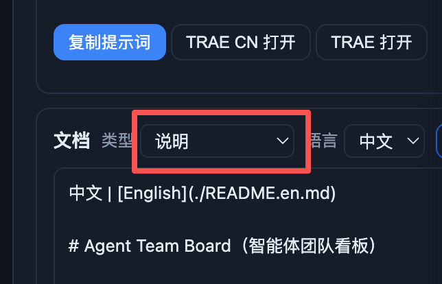

# BUG-20260921-004 版本计划中的文档预览界面，说明应该改成 README.md

- 状态：submitted（待人工接受）
- 归属：独立 Bug（引入来源见 design.md）
- 创建：2026-09-21T00:21:34.408Z

## 现象

「构建」模块「版本计划」页签中，选中版本后右侧详情五步流程的「文档编写」步里，下部「文档」区头部的「类型」下拉框当前选中值显示为「说明」（见截图红框），而不是真实文档标识 README。

补充观察（用于界定缺陷范围）：

- 仅中文界面出现：切换到 English 后同一位置显示 README，正常；
- 「类型」下拉的其余选项 CHANGELOG / FEATURES / AGENTS 显示正常；
- 「语言」下拉（中文 / 英文）、预览区正文、底部文档状态 chips（显示完整文件名，如 README.md）均不受影响。

缺陷位置：「文档编写」步类型下拉的选项文本渲染（scripts/web/build.js 的 renderDocsPane）与中文界面反向翻译词条的相互作用所致；根因分析与修复方案留待开发阶段写入 design.md。

## 复现步骤

前置：看板项目已存在至少一个版本（版本计划列表非空）；界面语言为中文（默认，右上语言按钮显示「EN」即当前为中文）。

1. 启动看板界面：`node scripts/server.mjs`（默认端口 8888）或桌面壳 `npm run app`。
2. 进入「构建」模块，停留在默认页签「版本计划」。
3. 在左侧版本列表选中任一版本，右侧打开版本详情（五步流程：版本计划 → 关联条目与提交 → 文档编写 → 合并入 main → 正式发布）。
4. 点击步骤页签「文档编写」。
5. 观察下部「文档」区头部的「类型」下拉框：选中值显示「说明」；展开下拉，README 一项同样显示为「说明」。
6. 对照：点击右上语言按钮切换到 English，同一「类型」下拉显示 README（正常）；切回中文，「说明」复现。

## 期望行为

- 「文档编写」步的「类型」下拉框，选中值与选项文本必须显示真实文档标识，不得显示「说明」——「说明」是看板条目详情抽屉文档页签的中文文案，与该处「选择哪份版本文档」的语义不符。
- 按报告人口径此处应显示 README.md（见本单标题）；当前代码渲染的是不带扩展名的裸键 README（与 CHANGELOG / FEATURES / AGENTS 口径一致）。最终显示口径（README 还是 README.md；若带 .md 是否四项统一）**待确认**，请人工在开发前定夺。
- 中文界面与英文界面显示一致正确（英文界面现状即正确，修复不应改变英文界面行为）。
- 不引入回归：条目详情抽屉的「说明」页签在中文界面仍应显示「说明」；「文档编写」步其余元素（语言下拉、编辑 / 预览切换、保存、提交反馈、文档 chips、预览内容）行为不变。

## 验收说明

1. 中文界面下进入 构建 → 版本计划 → 选中版本 → 文档编写步，「类型」下拉选中值与选项列表按定稿口径显示（README 或 README.md，见期望行为的待确认项），不再出现「说明」。
2. 切换到 English 再切回中文，「类型」下拉显示保持正确（语言往返切换不复现）。
3. CHANGELOG / FEATURES / AGENTS 三个选项在中文 / 英文界面均正常显示。
4. 回归检查：条目详情抽屉页签中文界面仍显示「说明」（该文案依赖现有 i18n 词条，修复不得破坏）；「文档编写」步其余交互（语言下拉、编辑 / 预览、保存、提交、文档 chips 切换）行为不变。
5. 若修复涉及 i18n 词典或翻译跳过处理，遵循中英文同步基线（BUG-20260912-001）：两语言同步修改并跑 i18n 相关测试；交付前 `npm test` 全量通过。

## 界面展示

可交互演示：[ui-demo.html](./ui-demo.html)（单文件、内联 CSS/JS、浏览器直接打开）。

- 界面布局：还原「文档编写」步结构——上部 AI 写作区（提示词只读框 + 复制提示词 / TRAE CN 打开 / TRAE 打开），中部「文档」区（类型 / 语言下拉、编辑 / 预览切换、保存），预览区展示 README 正文（语言行「中文 | English」+ 标题），底部文档状态 chips 与门禁提示 / 提交按钮。
- 交互行为：「类型」「语言」下拉联动预览内容；点击底部文档 chips 反向切换类型与语言；「编辑 / 预览」切换编辑器形态；保存 / 提交有 busy 态与结果反馈；复制提示词有点击反馈；读取失败可「重试」恢复。
- 状态反馈：演示控制条可切换 正常 / 加载中 / 读取失败 / 空文档 四种状态；「缺陷复现」开关对照中文界面缺陷现状（类型下拉显示「说明」）与期望修复后状态（显示 README.md）；界面语言切换可对照英文界面不受影响的事实；另附深浅色切换（可选能力）。
