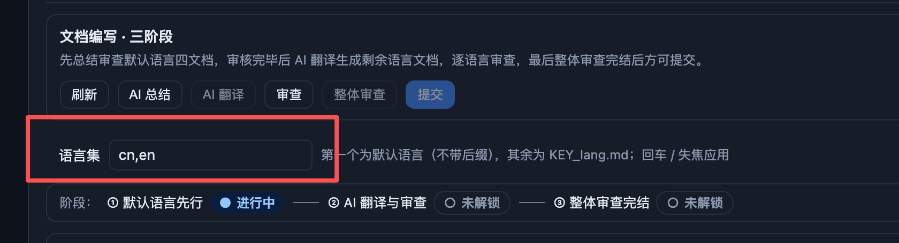

# BUG-20260921-012 语言集移到文档编写三阶段的右侧对齐

- 状态：submitted（待人工接受）
- 归属：独立 Bug（引入来源见 design.md）
- 创建：2026-09-21T07:54:27.954Z

## 现象

「发布」模块版本详情五步流程的「文档编写」步中，「文档编写 · 三阶段」副标题条下方的「语言集」输入行独占一整行（见截图）：副标题条内左侧为标题「文档编写 · 三阶段」与说明文字、右侧为六个操作按钮（刷新 / AI 总结 / AI 翻译 / 审查 / 整体审查 / 提交），而「语言集 标签 + `cn,en` 输入框 + 辅助说明」整体排在按钮行下方，导致标题行右侧留白、语言集与标题不在同一视觉层级，纵向也多占一行。

缺陷位置：`scripts/web/build.js` 的 `renderDocsPane`——语言集控件由 `langsField`（`.bld-docs-langset`）渲染，拼接在副标题条 `.bld-docs-sub`（左 `.bld-docs-subtitle` + 右 `.bld-docs-actions`）**之后**，作为独立一行输出；对应样式在 `scripts/web/style.css` 的 `.bld-docs-langset` / `.bld-docs-sub`。该输入框由 REQ-20260921-010 引入。根因分析与修复方案留待开发阶段写入 design.md。

## 复现步骤

前置：看板项目已存在至少一个构建版本（发布模块版本列表非空）；界面语言不限（中英文均可复现）。

1. 启动看板界面：`node scripts/server.mjs`（默认端口 8888）或桌面壳 `npm run app`。
2. 进入「发布」模块（原「构建」模块），在版本列表选中任一版本，右侧打开版本详情（五步流程：版本计划 → 关联条目与提交 → 文档编写 → 合并入 main → 正式发布）。
3. 点击步骤页签「文档编写」（步骤页签只改变浏览位置，前置未满足也可浏览）。
4. 观察面板顶部：「文档编写 · 三阶段」标题在左、六按钮在右，「语言集」标签 + 输入框（默认 `cn,en`）+ 辅助说明独占按钮行下方的一整行——即为本缺陷。
5. 对照交互仍正常：修改语言集（如改为 `cn,en,fr`）后回车或失焦，输入框下方报错或提示应用成功、文件清单按新语言集重新分组——功能不受影响，问题仅在落位。

## 期望行为

- 「语言集」控件（「语言集」标签 + 输入框）移动到「文档编写 · 三阶段」**标题所在行的右侧并对齐**，与标题同行，不再在副标题条下方独占一行。
- 落位微调（辅助说明文字与「保存中…」反馈的位置、六按钮行与说明文字的相对排布、窄屏换行）**待开发阶段 design 定稿**，但不得回退为「标题条下方独占一行」的现状。
- 现有交互与状态反馈必须全部保留，不得因移位弱化：
  - 回车 / 失焦应用，输入中草稿不因轮询重渲染丢字；
  - 客户端校验（空值 / 连续逗号空项 / 非 2–3 字母缩写 / 重复语言）就地行内红字报错，不应用非法值；
  - 应用成功 toast「✓ 语言集已应用：…」并联动文档清单（4 类 × N 语言）、门禁与审查对话框；
  - 保存中「保存中…」提示 + 输入框禁用；发布流程数据加载中 / 读取失败时输入框禁用（沿用现有 `phase !== 'ready'` 口径）。
- 中英文界面同步（BUG-20260912-001 基线）：两语言下均完成移位，词条同步维护。

## 验收说明

1. 布局：进入 发布 → 选中版本 → 文档编写步，「语言集」标签与输入框出现在「文档编写 · 三阶段」标题同一行的右侧并对齐；标题条下方不再有独占一行的语言集行。
2. 交互回归：语言集回车 / 失焦应用正常——合法值（如 `cn,en,fr`）应用后文件清单按语言重新分组（默认语言组 + 各剩余语言组）、门禁计数随动；非法值（空 / `cn,,en` / `cn1` / `cn,cn`）分别给出对应行内错误且不应用。
3. 状态反馈回归：保存中显示「保存中…」并禁用输入；发布流程数据读取失败态下输入禁用、错误横幅与「重试」不受移位影响；输入中草稿在自动轮询刷新后不丢字。
4. 中英文界面切换后移位与文案均正确（右上语言按钮往返切换检查）。
5. 窄屏（≤640px）无横向溢出，控件按现有响应式口径换行。
6. 若实现涉及 i18n 词典调整，遵循中英文同步基线并跑 i18n 相关测试；交付前 `npm test` 全量通过。

## 界面展示

可交互演示：[ui-demo.html](./ui-demo.html)（单文件、内联 CSS/JS、浏览器直接打开）。

- 界面布局：还原「文档编写」步副标题区结构——标题「文档编写 · 三阶段」+ 说明文字、六操作按钮（刷新 / AI 总结 / AI 翻译 / 审查 / 整体审查 / 提交）、语言集控件、三阶段阶段条与文件列表明细（默认语言组 / 剩余语言组按语言集动态分组）。「缺陷现状 / 期望修复」开关对照两种落位：现状为语言集独占标题条下方一行；期望为语言集与标题同行、右侧对齐（演示中的按钮行落位为示意，最终以开发阶段 design 为准）。
- 交互行为：语言集输入框可编辑，回车 / 失焦应用——合法值（如 `cn,en,fr`）重新分组文件清单并弹 toast；非法值（清空 / 连续逗号 / 非法缩写 / 重复项）就地行内红字报错且不应用；演示控制条可切换 正常 / 加载中 / 读取失败 / 保存中 状态。
- 状态反馈：加载中与读取失败态语言集输入禁用（读取失败附错误横幅 + 重试按钮，重试可恢复）；保存中显示「保存中…」并禁用；应用成功 / 失败均有 toast 反馈；另附深浅色切换（可选能力）。
