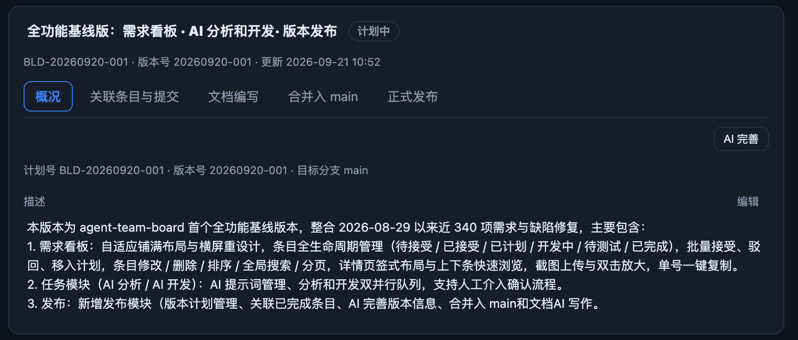

# BUG-20260921-016 删除下方的描述标签和计划号等标签，把 AI 完善和编辑放在同一行

- 状态：submitted（待人工接受）
- 归属：独立 Bug（引入来源见 design.md）
- 引入来源：REQ-20260920-003（引入概况元信息行，与详情头部重复）+ REQ-20260921-014（引入「描述 | 编辑」标签行）+ REQ-20260921-016（两键迁入描述块头行后标签行仍占位）
- 创建：2026-09-21T13:17:18.397Z

## 现象

构建模块「版本计划」页签，右侧版本详情第一个页签「概况」的内容区存在信息冗余与操作分散（布局链路经源码核实，`scripts/web/build.js` `renderDetail` 3312–3340 行）：

1. **「AI 完善」独占一行**：概况内容区顶部是一行右对齐的操作行（`.bld-plan-acts`，style.css 3055–3058 行），里面只有「AI 完善」一个按钮（REQ-20260921-013 从版本卡片迁入）。
2. **元信息行与详情头部重复**：其下一行 muted 元信息「计划号 BLD-… · 版本号 … · 目标分支 main ·（来源分支 …）」（build.js 3338 行），其中**计划号、版本号与详情头部第二行元信息**「BLD-… · 版本号 … · 更新 …」（build.js 3366 行）完全重复。
3. **「描述」标签行占位**：再往下是描述块头行（`.bld-desc-block-head`，REQ-20260921-014）：左侧「描述」标签、右侧「编辑」按钮——于是针对同一版本的两个操作「AI 完善」与「编辑」被分置两行，中间还隔着一行重复元信息，竖向空间浪费且视线跳动。

结果即截图所示：概况页签前几行依次是「AI 完善」→「计划号 … · 目标分支 …」→「描述 | 编辑」→ 描述正文，标签行没有承载增量信息（计划号 / 版本号头部已有），操作却分散在第一行与第三行。

## 复现步骤

前置：项目目录运行 `atb serve`（默认端口 8888，`ATB_PORT` 可覆盖），浏览器打开 `http://localhost:8888`，顶栏选中该项目。

1. 进入「构建」模块「版本计划」页签，左侧任选一张版本卡片（如 BLD-20260920-001，计划中 / draft 状态即可），右侧详情默认停在第一步页签「概况」。
2. 观察概况内容区第一行：只有右对齐的「AI 完善」按钮，独占一行。
3. 观察第二行元信息：「计划号 BLD-20260920-001 · 版本号 20260920-001 · 目标分支 main」——与详情头部的「BLD-20260920-001 · 版本号 20260920-001 · 更新 …」重复展示计划号与版本号。
4. 观察第三行描述块头行：左侧「描述」标签、右侧「编辑」按钮——「AI 完善」与「编辑」分处两行。
5. 任意版本状态均可复现：draft（计划中）/ merging（合并中）/ merged（已合并）/ failed（失败）布局相同；merging 时「AI 完善」「编辑」禁用（title 说明原因）但上述冗余布局不变。

## 期望行为

- **删除概况内容区的元信息行**（计划号 · 版本号 · 目标分支 · 来源分支，build.js 3338 行）：计划号 / 版本号在详情头部元信息行已有，不再重复展示。
- **删除描述块头行的「描述」标签**：描述正文直接跟在操作行之后展示。
- **「AI 完善」与「编辑」合并到同一行**：概况内容区顶部只保留一行右对齐操作行（沿用 `.bld-plan-acts` 布局），两键同排；窄屏空间不足时自动换行（既有 flex-wrap 口径不变）。行内次序不硬性规定，由开发阶段定夺。
- **既有口径全部不变**：
  - 「AI 完善」锁定口径（BUG-20260920-005）：merging 禁用（title「合并中，请稍候……」）；推送完成（正式发布）后禁用（title「已正式发布，不允许再 AI 完善」）；merged 未推送可用。
  - 「编辑」锁定口径（REQ-20260921-014）：merging 禁用（title「版本合并中，暂不可修改」）。
  - 点「编辑」仍就地展开「版本名称 + 版本描述」同一表单（`renderPlanEditForm`：输入计数、就地错误、「保存 / 取消」）替换描述区；编辑态下操作行的「编辑」键随表单打开而让位（表单自带保存 / 取消），「AI 完善」保留原位；行内点击描述正文的遗留快捷编辑路径不变。
  - merging「合并中，请稍候……」提示与合并失败信息（`mergeState`）随布局上移，展示口径不变。
  - 五步导航（概况 → 关联条目与提交 → 文档编写 → 合并入 main → 正式发布）与详情头部（名称 + 状态章 + 计划号 / 版本号 / 更新时间）不受影响。
- **目标分支 / 来源分支信息**：随元信息行删除后详情内不再展示（目标分支默认 `main`、合并流程目标固定即 main；来源分支仅合并后存在，`merge.baseBranch`）。是否需要在别处保留（如并入头部元信息行）——**待确认**，默认不保留。
- **文案**：删减的「描述」标签等文案随布局清理，中英文案同步 `scripts/web/i18n.js`（既有键「描述 / 编辑 / AI 完善」等不误删误译）。

## 验收说明

1. **布局**：概况内容区仅剩两块——一行右对齐操作行（「AI 完善」+「编辑」同排）与描述正文；无「计划号 … · 目标分支 …」元信息行、无「描述」标签行；窄屏下操作行自动换行、不遮挡描述与五步导航。
2. **操作行状态**：非锁定态两键均可用；merging 版本两键禁用且 title 分别说明原因（「合并中，请稍候……」「版本合并中，暂不可修改」）；推送完成（正式发布）后「AI 完善」禁用（title「已正式发布，不允许再 AI 完善」）而「编辑」仍按既有口径可用。
3. **编辑链路回归**：点「编辑」就地展开名称 + 描述表单，计数（名称 / 描述字数上限）、就地错误提示、「保存 / 取消」均不回归；保存后名称与描述正确刷新、取消无副作用；描述正文行内点击编辑的遗留路径不回归。
4. **AI 完善链路回归**：两段式弹窗（复制提示词 → 粘贴回答解析预览 → 应用回填）完整走通；merging / 推送完成禁用口径与既有测试断言不回退。
5. **信息完整性**：详情头部仍完整显示计划号、版本号、更新时间；五步导航、merging 提示 / 合并失败信息展示不受布局调整影响。
6. **文案与外观**：i18n 中英文同步（删除标签的键清理，不残留误译）；深浅色两套主题下表现一致，Electron 桌面壳内无异样。
7. **测试同步**：补充概况页签布局断言（操作行合并、元信息行与描述标签删除、锁定态 title）；受影响的既有断言同步调整；`node scripts/tests/run-all.mjs` 全量通过。

## 界面展示

可交互演示：[`./ui-demo.html`](./ui-demo.html)（单文件、内联 CSS / JS、无外网依赖、无构建步骤，浏览器直接打开可交互；数据为模拟，不连真实看板、不发真实请求）。

- 界面布局：还原构建模块「版本计划」页签——左侧版本卡片（名称 + 状态章 + 计划号 / 版本号 / 阶段）、右侧详情（头部名称与元信息 + 五步导航，概况页签内容区）；含 AI 完善两段式弹窗与就地编辑表单。
- 交互行为：一键切换「当前（缺陷）/ 修复后（期望）」对照——缺陷态下「AI 完善」独占一行、其下重复元信息行、「描述 | 编辑」标签行；期望态下「AI 完善」与「编辑」同排一行、标签行全部移除、描述正文直接呈现。可点「编辑」走就地表单（保存 / 取消 / 字数计数），可点「AI 完善」走弹窗两段式（复制 → 解析预览 → 应用）。
- 状态反馈：版本状态可切「计划中 / 合并中 / 已合并（未推送）/ 已推送（正式发布）」联动按钮禁用与 title 原因；详情数据可切「正常 / 无描述（空）/ 加载中 / 加载失败（可重试）」；toast 呈现保存 / 应用 / 复制结果；深浅色随系统并可手动切换。

## 关联

- 引入来源：见 design.md（修复阶段归因；现状布局由 REQ-20260921-013「AI 完善」迁入概况顶部操作行与 REQ-20260921-014 描述块头行「描述 | 编辑」叠加落定，元信息行源自 REQ-20260920-003 五步流程改造）。
- 相关：REQ-20260921-013（AI 完善迁入概况操作行）、REQ-20260921-014（概况显式编辑按钮）、REQ-20260920-003（五步流程与详情头部元信息口径）、BUG-20260920-005（AI 完善锁定基准，禁用口径须保持）。
