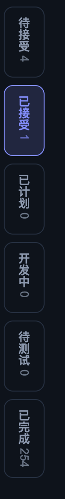

# REQ-20260913-002 左侧的状态分类区域移到上方副标题和搜索区域中间，以确保英文界面状态文案清晰可见

- 状态：submitted（待人工接受）
- 创建：2026-09-12T23:39:01.963Z

## 描述

### 现状（已核实的代码事实）

以下事实核实自本项目前端源码（`scripts/web/`，2026-09-13）：

- 需求模块的六档状态分类（待接受 / 已接受 / 已计划 / 开发中 / 待测试 / 已完成）由
  `nav#filterBar.filter-bar`（`aria-label="按状态筛选需求"`）承载，是 `main#reqView.req-view`
  的第一个子元素（`scripts/web/index.html` 第 102 行，位于 `#emptyState` 与 `.req-split` 之前）。
- `scripts/web/style.css` 的 `.filter-bar`（第 271–282 行）将其渲染为内容区左缘的固定窄栏：
  `flex-direction: column`、`width: 64px`、`padding: 14px 10px`，高度不足时 `overflow-y: auto`
  竖向滚动。`.req-view` 为 `display: flex; flex-direction: row`（第 351–358 行），故窄栏贴内容区左缘。
- 栏内档位按钮 `.filter-bar .filter-chip`（第 301–311 行）使用 `writing-mode: vertical-rl;
  text-orientation: mixed; min-height: 76px; padding: 10px 5px`，文字从上到下直排。
- chips 由 `scripts/web/app.js` 的 `renderFilterBar()`（第 1844–1852 行）随轮询重建：每个 chip 为
  `button.filter-chip[data-filter]`，内含档位标签 + `.filter-count` 计数；档位与标签来自
  `LANES` / `LANE_LABEL`（app.js 第 13–14 行）。
- 第三行（副标题 + 搜索）为 `section#pageHead.page-head`（index.html 第 70–91 行）：
  `#moduleSub.module-sub` 居左，`#locateGroup.locate-group`（内含排序下拉 `#reqSort` 与搜索框
  `.global-search.module-search`）以 `margin-left: auto` 靠右；`.page-head` 为
  `display: flex; align-items: center; gap: 12px; flex-wrap: wrap`（style.css 第 173–180 行）。
- 显隐：`#filterBar` 仅在需求模块（`view === 'status'`）且项目已初始化时显示
  （app.js 第 1104、1981 行），否则加 `hidden`。
- 界面语言切换（REQ-20260911-005）提供的六档英文文案（`scripts/web/i18n.js` 第 35–40 行）：
  待接受→Pending、已接受→Accepted、已计划→Planned、开发中→Developing、待测试→In test、已完成→Done。
- chips 点击为容器级事件委托（app.js 第 6979–6985 行）：点击 → 设置 `state.reqFilter` →
  `renderBoard()` 重绘列表与选中态 → `saveViewSnapshot()` 把筛选档记入视图快照。

### 问题

状态文案被压进 64px 宽的左缘竖栏并强制竖排：中文已逐字竖排（见截图），而英文文案
（Pending / Accepted / Planned / Developing / In test / Done）在 `text-orientation: mixed` 下
整体旋转 90° 排布，挤在 `min-height: 76px` 的窄高按钮里，英文界面下状态文案几乎不可读，
也与横向阅读的自然语序相悖。

### 目标（一段话）

把状态分类区域从内容区左缘竖栏移到第三行 `#pageHead` 内部——副标题（`#moduleSub`）之后、
搜索定位组（`#locateGroup`）之前，chips 改为横向排列，使中英文状态文案都能水平完整展示，
英文界面状态文案清晰可见。

## 验收标准

- [ ] 需求模块下，状态分类 chips 渲染在第三行副标题（#moduleSub）与搜索定位组（#locateGroup）之间；
      内容区左缘不再出现 64px 竖向筛选栏，`#filterBar` 不再是 `#reqView` 的子元素。
- [ ] chips 横向排列、文字水平展示；中文（待接受…已完成）与英文
      （Pending / Accepted / Planned / Developing / In test / Done）均完整可读，
      不逐字竖排、不旋转 90°、不裁切、无省略号截断。
- [ ] 每个 chip 仍带档位计数（.filter-count），计数随轮询刷新保持准确。
- [ ] 点击 chip 切换筛选档的行为与现状一致：列表按档过滤、chip 呈 active 高亮、
      筛选档写入视图快照（saveViewSnapshot）；「全部档位共存」不引入新的默认档。
- [ ] 显隐口径不变：仅需求模块且项目已初始化时可见；切到任务/设置模块或项目未初始化时隐藏，
      第三行其余内容（副标题、排序、搜索）不受影响。
- [ ] 第三行既有布局职责不被破坏：宽屏副标题居左、定位组靠右；窄屏（≤720px 媒体查询，style.css
      第 1715–1722 行）下按 `.page-head` 的 `flex-wrap: wrap` 规则整组换行，
      不产生页面横向滚动、不裁切。
- [ ] 深浅色外观下 chips 均可读（沿用 `.filter-chip` 既有配色变量：边框 `--border`、
      active 态 `--viewrail-accent` 系）。
- [ ] 移除左缘竖栏后，列表 + 详情并排内容区（.req-split）获得全宽，列表与详情布局无回归。

## 界面布局

目标布局（需求模块，宽屏自上而下）：

1. 顶栏（不变）：品牌区 / 模块页签 / 操作区。
2. 第三行（本条目改动所在行，`#pageHead` 一行内从左到右）：
   `副标题（#moduleSub）` → `状态分类 chips（#filterBar，横向一排六个）` →
   `定位组（#locateGroup：排序下拉 + 搜索框，靠右）`。
   - chips 横排、等高（与定位组控件视觉协调，具体高度与间距由开发阶段 design 定），
     当前档 chip 高亮（active 描边 + 浅色底），计数以弱化色跟随标签右侧。
   - 宽度不足时按 `.page-head` 既有 `flex-wrap: wrap` 整体换行，chips 行可独立成行，
     不与副标题/搜索框交叉挤压。
3. 内容区（不变）：列表 + 详情并排（.req-split），左缘竖栏移除后占满整行宽度。

现状布局（对照）：`#filterBar` 为 `#reqView` 内左缘 64px 竖栏，chips 文字竖排。

## 交互行为

- 点击任一状态 chip：切换 `state.reqFilter` 到对应档位，列表即时按档过滤重绘，
  被点 chip 进入 active 高亮态，其余恢复常规态；筛选档写入视图快照，刷新后恢复
  （与现状 app.js 第 6979–6985 行行为一致）。
- 再次点击已选中的 chip：维持现状口径——已核实现有代码（app.js 第 6979–6985 行）点击任意 chip
  均直接把 `state.reqFilter` 设为该档，无「全部」档、不支持点击取消筛选；本条目不改变该口径。
- 悬停 chip：hover 态文字/边框变色（沿用现有 `.filter-chip:hover`）。
- 语言切换（EN ⇄ 中）：chips 标签随 i18n 即时切换为 Pending / Accepted / Planned /
  Developing / In test / Done，横排下保持完整可读。
- 键盘可达：chip 为原生 `button`，Tab 可聚焦、Enter/Space 可触发（沿用现状）。

## 状态反馈

- 正常态：六个 chip 常显（需求模块且项目已初始化），各档计数实时跟随轮询刷新；
  当前档 chip 以 active 高亮（主题色描边 + 浅色底 + 主题色文字）标识。
- 空档：某档计数为 0 时 chip 保留（计数显示 0），点击后列表区展示该档空态，不隐藏 chip。
- 未初始化 / 非需求模块：`#filterBar` 整体隐藏（现状 hidden 口径不变），
  第三行仅剩副标题与定位组；空态卡（#emptyState）照常在内容区展示。
- 加载中：chips 由 `renderFilterBar()` 随轮询整体重建，轮询间隙保持上一次渲染结果，
  不闪烁、不出现中间空白（与现状机制一致）。
- 失败（服务不可达 / 轮询失败）：chips 保持最后一次成功渲染的结果，不出现布局塌陷；
  失败提示由既有全局轮询反馈承载（本条目不新增失败 UI，待确认既有轮询失败提示的具体形态，
  本条目不改动它）。
- 深浅色外观：chip 边框、文字、active 底色均沿用主题变量，两种外观下对比度可读。

## 界面展示

可交互演示：[./ui-demo.html](./ui-demo.html)（单文件、内联 CSS/JS、无外网依赖、无构建步骤，
浏览器直接打开即可交互）。

演示覆盖：

- **现状 vs 目标对照**：同一页面分「现状布局（状态分类在内容区左缘竖栏、文字竖排）」与
  「目标布局（状态分类在副标题与搜索区域之间横排）」两栏并排，可切换需求/英文两种界面语言，
  直观对比英文状态文案（Pending / Accepted / Planned / Developing / In test / Done）
  在两种布局下的可读性差异。
- **交互行为**：两种布局中均可点击状态 chip 切换筛选档（active 高亮联动 + 列表条目按档过滤）、
  悬停反馈、中英文标签即时切换。
- **状态反馈**：演示页提供「正常 / 空档（计数 0）/ 未初始化（分类区隐藏）/ 加载中 / 失败」
  状态切换按钮，展示各状态下第三行分类区的表现。
- **深浅色适配**：演示页跟随系统 `prefers-color-scheme` 并提供手动切换。
