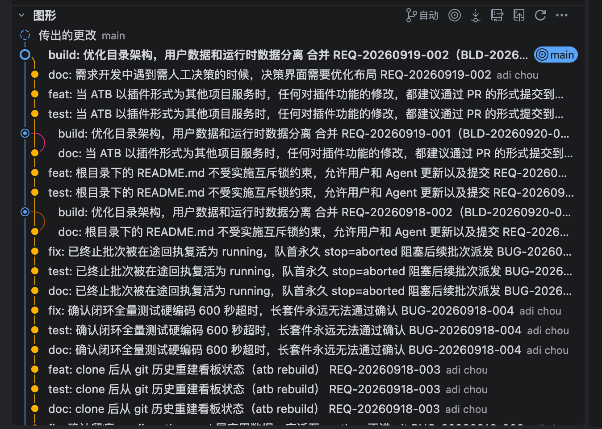

# REQ-20260920-001 分支浏览界面的 git 历史树展示要展示分支合并记录，而不是现在的平铺。具体展示效果可以查看截图

- 状态：submitted（待人工接受）
- 创建：2026-09-20T05:16:42.684Z

## 描述

将「构建 → 分支浏览」当前分支的提交记录由平铺列表升级为 Git 拓扑图，让用户直接看出提交的分叉、分支上的提交以及合并回主线的位置。参考附件的彩色轨道、节点与合并连线表达方式，不要求复制截图所属工具的全部工具栏功能。

### 已核实的现状与范围

- `scripts/web/build.js` 的分支浏览保留左侧分支列表，右侧提交列表目前只展示短 hash、主题、作者与时间；已有分支切换、关键词搜索、20/50/100 条分页、加载提示和失败重试。
- `scripts/lib/build-git.mjs` 的 `branchLog` / 搜索读取提交元信息，目前输出格式不含父提交信息。因此图中的连线必须以实际父提交关系为依据，不能从提交主题含“合并”、行次序或当前分支名称推测关系。
- 展示当前所选本地或远端分支可达的历史，保留已有搜索和分页语义；本次不增加 checkout、merge、rebase 或提交修改操作。仅浏览不得改动工作区或 Git 引用。
- 截图的“传出的更改”、工具栏按钮不作为本单新增能力。具体图形库、轨道算法与性能指标待确认，留开发阶段设计；不得把演示虚构提交当作真实项目历史。

### 界面布局

右侧顶部保留分支名、搜索和分页入口，下方每行左侧新增固定对齐的图形区域，依次展示轨道线、提交节点及分叉/汇合曲线，右侧保留短 hash、主题、作者、时间。当前引用可用标签标明，但不能给无引用的历史轨道编造分支名。合并节点与普通节点应有形状或文字区分，不能只靠颜色传达含义。长主题可截断并提供完整内容，窄屏允许横向滚动，图形与对应行不得错位。

### 交互行为与状态反馈

- 切换分支后刷新对应历史并按现有行为重置搜索；图形只连接真实父子节点。普通线性历史是一条连续轨道；两父或多父合并展示所有真实父边；分支已删除也不丢失其可达提交与合并关系。
- 保留搜索关键词和分页能力。搜索隐藏的中间节点不能被画成直接父子关系；以明确的“中间提交未显示”断点或虚线延续表示上下文缺失。分页边界的父提交未加载时显示延续标记，不误画成根提交；同一页内不重复提交节点。
- 正常态展示拓扑和提交信息；加载态明确提示并避免旧分支图形冒充新分支结果；空历史与搜索无匹配分别解释原因；失败态显示原因及重试入口，翻页失败保留上一页结果且标明失败，不以空历史替代错误。
- 图形可通过聚焦/选择节点查看该提交与父提交标识，作为关系辨识反馈；此交互只读。键盘可访问搜索、分支、分页和节点；文本信息说明合并父数与边界延续，照顾无法辨色的用户。

## 界面展示

[打开可交互演示](./ui-demo.html)。演示为单文件、内联 CSS/JS、无外网依赖，直接在浏览器打开。左侧切换 main / feature，右侧展示彩色轨道、合并节点、元信息与节点选择反馈；搜索演示隐藏上下文的标记；状态选择器覆盖正常、空、加载和失败，失败可重试。演示使用明确标记的虚构提交，分页边界可通过“边界示意”切换观察；正式产品继续沿用已有分页控件。

## 验收标准

- [ ] 含真实分叉和合并的仓库中，当前分支可达提交显示图形轨道；节点数与展示的提交数一致，合并位置、父提交数量和连接关系与 Git 数据一致，不依赖主题文本识别合并。
- [ ] 线性历史、两父合并、多父合并、已删除分支的可达历史均无假连线、漏父边或重复节点；根提交无向下虚构连线。
- [ ] hash、主题、作者、时间仍可阅读，合并节点有非颜色提示；长标题及窄屏滚动时节点与文本保持对应。
- [ ] 切换本地/远端分支更新对应拓扑，保留既有搜索重置行为；所有浏览操作不切换实际工作区分支、不修改引用和文件。
- [ ] 原有搜索范围及 20/50/100 条分页仍有效；搜索缺失上下文与跨页父边明确显示延续，不能把未显示的中间提交误连成直接父边，也不能误判为根节点。
- [ ] 正常、首次加载、空历史、搜索无结果、首次失败及翻页失败有可区分反馈；失败可重试，翻页失败保留上一页可用内容。
- [ ] 鼠标与键盘均可查看提交及父提交信息；新界面文案中英文同步，浅色/深色下轨道、文本及选中态可辨认。
- [ ] README 链接的 ui-demo.html 可离线直接打开，分支/搜索/节点选择/状态切换/重试/边界示意交互可用，且明确注明模拟数据。
