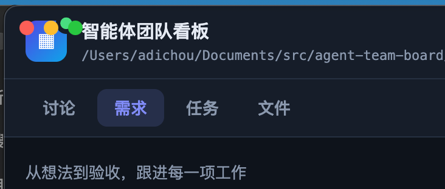

# BUG-20260909-019 左上角有元素遮挡，请修复

- 状态：accepted（已接受；本轮仅完善说明，未实施修复）
- 归属：独立 Bug（引入来源见 design.md）
- 引入来源：未定位（排查线索见「现象 · 核实依据」末条；确切失效环节由开发阶段 design.md 归因，不在此预判）
- 创建：2026-09-09T15:53:57.290Z

## 现象

macOS Electron 桌面壳窗口（REQ-20260905-001）内，窗口左上的红 / 黄 / 绿交通灯**直接压在看板顶栏的品牌区上**：三个圆点叠在蓝色渐变 logo 图标（「▦」，34×34 圆角方块）的左上部，logo 右上角的绿色实时状态点也被卷入重叠区域；标题「智能体团队看板」与项目路径紧随 logo 之后，与交通灯同处一行。即标题所述「左上角有元素遮挡」。

该形态意味着既有的交通灯让位机制未按预期生效：壳层窗口使用 `titleBarStyle: 'hiddenInset'`（`electron/main.mjs` 第 27 行），交通灯悬浮于页面内容之上；BUG-20260905-003 针对同类遮挡引入了让位样式——每次页面加载完成（`did-finish-load`）经 `webContents.insertCSS` 注入 `.topbar { padding-left: 78px; }`（`electron/main.mjs` 第 33–35 行、`electron/shell-css.mjs` 第 6–9 行，注释口径：交通灯约占 70px 宽，78px 让位）。截图所示遮挡正是让位样式未生效（或被覆盖）时的表现。浏览器直连看板（`http://127.0.0.1:8888`）没有交通灯，不存在此问题——缺陷仅限 Electron 桌面壳窗口。

### 核实依据（源码与看板记录，2026-09-10 核对）

- `electron/main.mjs` 第 24–37 行：窗口默认 1360×850、`titleBarStyle: 'hiddenInset'`；`did-finish-load` 时注入让位样式，注释注明「避免遮挡顶栏 .brand 文字（BUG-20260905-003）」。
- `electron/shell-css.mjs` 第 6–9 行：`TRAFFIC_LIGHT_INSET_CSS = '.topbar { padding-left: 78px; }'`，纯常量模块，仅壳层窗口注入生效。
- `scripts/web/index.html` 第 14–31 行：顶栏结构 `.brand`（`.logo-badge` = logo「▦」 + 实时状态点 `#pollState`；`.brand-text` = 标题 + `#dataDir` 路径）居左、`.top-actions`（项目切换器 / 待处理徽标 /「＋ 新建」）居右。
- `scripts/web/style.css`：第 92–102 行 `.topbar` 基础规则 `padding: 10px 18px`（含 padding-left 18px）；第 104–111 行 `.logo` 34×34；第 129–139 行 `.poll` 状态点以负偏移悬于 logo 右上角；第 1146–1158 行 `@media (max-width: 640px)` 将 `.topbar` 覆盖为 `padding: 8px 12px`（该块注释自述依赖级联顺序取胜）。
- `scripts/tests/electron-shell.test.mjs` 第 134–158 行「V4 注入契约（BUG-20260905-003）」：静态断言注入样式 `padding-left ≥ 70px`、web 业务样式不含 78px、`.topbar` 基础内边距保持 `10px 18px`——仅核对源码文本，**不验证注入样式加载后的实际层叠结果**，故无法拦截本单这类「源码在、效果无」的失效。
- 看板记录（`atb list` 核验，2026-09-10）：BUG-20260905-003「Electron 壳窗口交通灯与看板顶栏文字重叠」存在且仍为 in-progress——同类遮挡的治理未闭环，本单为其在现行顶栏（REQ-20260907-004「品牌区居左」结构）上的再次表现。
- 让位失效的确切环节（注入时序、被后载同优先级规则覆盖、特定宽度 / 重载路径、注入 promise 被吞等）本轮未启动 Electron 实测（约定不自动运行 app），**待确认**，归因留待开发阶段 design.md。

## 复现步骤

前置：macOS、本项目依赖已安装（Electron 37）。桌面壳启动方式：项目根目录 `npm run app`（即 `electron .`，package.json 的 `scripts.app`；壳会自动拉起 `scripts/server.mjs` 服务，就绪后加载 `http://127.0.0.1:8888`）。

1. 项目根执行 `npm run app` 启动桌面壳，等待看板页加载完成（顶栏出现蓝色 logo、「智能体团队看板」标题与项目路径）。
2. 观察窗口左上：红黄绿三个交通灯圆点直接叠在蓝色 logo 图标上（即附件截图形态）。
3. 窗口内按 Cmd-R 重载页面，再次观察：`did-finish-load` 理论上每次加载都会重新注入让位样式，重载后遮挡是否依旧**待确认**（用于区分「首载即失效」与「重载后失效」两类环节）。
4. 拖窄窗口宽度至 ≤640px（触发 `style.css` 竖屏分支，`.topbar` 内边距被覆盖为 `8px 12px`）后观察：该分支下让位是否有效**待确认**。
5. 对照实验：浏览器打开同一服务 `http://127.0.0.1:8888`——无交通灯，无遮挡。
6. 记录环境：窗口默认 1360×850（`electron/main.mjs`），附件截图为深色外观；浅色外观及非默认尺寸下的表现**待确认**。

说明：第 1–2 步的形态由用户附件截图证实；第 3、4、6 步的必现性本轮未实测，属修复阶段需一并验证的边界。

## 期望行为

1. **交通灯不遮挡顶栏任何可见元素**：桌面壳窗口内，红黄绿交通灯与品牌区（logo、实时状态点、标题、项目路径）互不重叠，顶栏左侧保持交通灯宽度的水平让位（现行契约值 78px，量级 ≥70px）。
2. **让位持续有效**：首次加载、Cmd-R 重载、窗口任意宽度（含 ≤640px 竖屏分支）、深浅色外观下均不回退到遮挡形态；修复须保证让位样式在真实窗口中生效并稳定赢得层叠，而非仅源码文本存在（弥补 V4 契约测试「只查文本、不查效果」的盲区）。
3. **浏览器直连不受影响**：web 业务样式不引入壳层让位值（`scripts/web/style.css` 不含 78px、`.topbar` 基础内边距保持 `10px 18px`，V4 契约口径不回退）。
4. **先归因再修复**：design.md 须写明 BUG-20260905-003 让位机制失效的确切环节（按引入来源三选一口径登记），禁止仅放大 padding 数值掩盖根因；具体修复方案（注入方式 / 时机调整、`trafficLightPosition` 显式定位等）与最终取值**待确认**，由开发阶段定夺。

## 界面展示

界面布局与状态反馈的文字说明（对照缺陷现状与修复后期望）：

- 界面布局：macOS 壳窗口自上而下为「窗口标题栏（交通灯悬浮于左上，`hiddenInset` 无原生标题栏）→ 看板顶栏 `.topbar`（左：logo「▦」+ 右上角实时状态点 + 标题「智能体团队看板」+ 等宽字体项目路径；右：项目切换器、「＋ 新建」）→ 模块导航（讨论 / 需求 / 任务 / 文件 / 设置）→ 列表工作区」。缺陷现状：交通灯（约 70px 宽）与 logo 直接重叠（顶栏左内边距仅 18px / 竖屏 12px）；修复后期望：顶栏左侧让位 78px，品牌区整体右移，交通灯独占左上留白区。
- 交互行为：「缺陷现状 / 修复后期望」两种形态切换对照；「宽屏 / 竖屏（≤640px）」窗口宽度切换（竖屏下路径隐藏、顶栏可换行，验证让位在该分支同样有效）；「桌面壳 / 浏览器直连」环境对照（浏览器无交通灯，展示不受影响的对照形态）；「重新加载页面」按钮模拟 Cmd-R，经短暂加载态后回到所选形态（验证让位在重载后是否保持）；实时状态点「在线 / 离线」切换；深 / 浅色外观切换（默认跟随系统）。
- 状态反馈：加载中——重载时顶栏内容以「页面加载中…」占位过渡；正常——在线态绿色状态点「● 实时」悬于 logo 右上角；空——看板未初始化时列表区显示「当前项目尚未初始化看板」空态卡（不影响顶栏让位形态）；失败（离线）——状态点转灰「○ 服务离线」；切换形态时，演示页给出当前让位间距与「遮挡 / 未遮挡」判定徽标的即时变化，操作日志逐条记录关键动作。

可交互演示：[./ui-demo.html](./ui-demo.html)（单文件、无外网依赖、无构建，浏览器直接打开；含缺陷 / 期望形态对照、宽窄屏、桌面壳 / 浏览器直连环境对照、重载加载态、空态与离线态、深浅色切换和操作日志）。演示为缺陷现状与期望形态的示意，最终修复方案以开发阶段 design.md 为准。

## 验收说明

- [ ] 桌面壳默认尺寸（1360×850）首次加载：交通灯与 logo、实时状态点、标题、项目路径无任何重叠，顶栏左侧让位间距达到交通灯宽度量级（≥70px，现行契约 78px）。
- [ ] Cmd-R 重载页面（以及看板内任何触发整页重载的路径）后，让位依然生效，不回退为遮挡。
- [ ] 窗口宽度拖窄至 ≤640px：交通灯仍不遮挡顶栏元素；竖屏分支既有行为（路径隐藏、顶栏换行右对齐等 REQ-20260903-002 口径）不回退。
- [ ] 深色 / 浅色两种外观下均无遮挡与样式异常。
- [ ] 浏览器直连 `http://127.0.0.1:8888` 无回归：`scripts/web/style.css` 不含 78px 让位值、`.topbar` 基础内边距保持 `10px 18px`（`electron-shell.test.mjs` V4 契约）。
- [ ] 修复前 design.md 完成归因（BUG-20260905-003 让位机制失效的确切环节，引入来源三选一口径）；若调整注入方式或取值，`scripts/tests/electron-shell.test.mjs` V4 相应断言同步更新，`node scripts/tests/run-all.mjs` 全部通过。
- [ ] 与同类前置单 BUG-20260905-003（仍 in-progress）的收口关系有明确结论：本单修复后该单一并完成，或注明差异另行处理，避免双单悬空。

## 关联

- 同类前置：BUG-20260905-003「Electron 壳窗口交通灯与看板顶栏文字重叠」（in-progress，`atb list` 核验存在）——insertCSS 让位方案来源单；本单为该让位在现行界面上失效的表现。
- 壳层来源：REQ-20260905-001（Electron 桌面壳，`hiddenInset` 标题栏决策）。
- 顶栏结构背景：REQ-20260907-004（现行顶栏「品牌区居左 / 操作居右」布局）、REQ-20260906-009（实时状态点叠加于 logo 右上角，缺陷态被波及元素）、REQ-20260903-002（≤640px 竖屏顶栏分支，修复须在该分支同样生效）。
