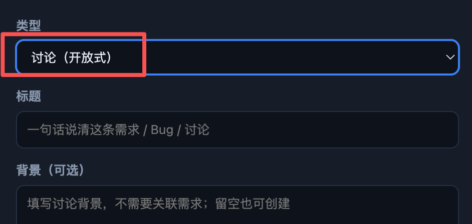

# BUG-20260910-006 讨论（开放式）要修改

- 状态：accepted（已接受）
- 归属：独立 Bug（引入来源见 design.md）
- 创建：2026-09-10T03:18:56.295Z

## 现象

新建条目的「类型」下拉框选择讨论后，当前显示「讨论（开放式）」。报告截图用红框标出了这段类型名称，标题要求修改；具体替换文字、是否仅删除括号内容、是否需同步其他入口均为「待确认」。现有材料未显示创建失败或讨论功能异常，不据此扩大为功能缺陷。

### 已核实证据

- `scripts/web/index.html` 的 `#fType` 包含 `<option value="ask">讨论（开放式）</option>`，与截图一致。
- `scripts/web/app.js` 的 `syncNewFormFields` 将讨论描述字段改为「背景（可选）」，提示「填写讨论背景，不需要关联需求；留空也可创建」。截图同样展示该布局。
- `scripts/tests/workbench-layout.test.mjs` 当前断言「讨论（开放式）」存在，修改正式文案后须在开发阶段同步相关断言。现有断言引用 BUG-20260907-014，这仅说明约束出处，不构成已定位本 Bug 的引入来源。
- 实际浏览器版本、操作系统版本、首次发生版本：待确认。本轮依据附件与代码核实，未执行浏览器复现。

## 复现步骤

1. 打开当前项目的状态看板，使用统一新建入口打开「新建条目」弹窗。
2. 展开「类型」下拉框，选择讨论选项。
3. 观察下拉框选中值，当前为「讨论（开放式）」，对应附件红框位置。
4. 观察下方为标题输入框和「背景（可选）」输入区域，确认处于讨论创建表单；无需提交即可观察问题。

## 期望行为

1. 类型选项及选中后显示的名称采用确认后的统一文案。最终文案：待确认；目前不能将「讨论」或「讨论（ASK）」等候选当作已批准结果。
2. 本条定位于截图标出的类型名称；其他页面的「开放式讨论」是否同步更名：待确认，应在开发前明确范围。
3. 文案调整后，讨论类型仍对应 `ask`，选择后继续显示标题与可选背景，保留既有讨论创建流程，不因展示名称改变而切换到需求或 Bug。

## 界面展示

- 界面布局：沿用截图所示垂直排列的类型、标题、背景区域，修改目标为顶部类型下拉框中的显示文字。
- 交互行为：用户展开类型选项并选择讨论，收起后显示确认后的同一名称；切换到需求或 Bug 后仍显示对应表单字段。
- 状态反馈：聚焦下拉框时保持清晰的焦点边框；标题为空时继续阻止创建，背景为空仍可创建；提交过程和失败反馈沿用现有流程，截图未提供具体反馈样式，细节待确认。
- [交互演示（ui-demo.html）](./ui-demo.html)：切换「缺陷现象 / 修复后状态」——缺陷态选中讨论后显示「讨论（开放式）」；修复态收起后显示确认后的同一名称（演示以「讨论」示意，最终文案待确认）。含焦点边框、标题为空阻止创建、背景留空可创建、切换类型联动表单字段。
- 展示依据为上方原始截图。

## 验收说明

- [ ] 开发前记录最终类型名称和需同步的入口范围，解决上述「待确认」项后再判断文案是否符合预期。
- [ ] 新建弹窗展开列表与收起后的选中值均使用确认文案，不出现一处更新、一处保留旧称的情况。
- [ ] 选择讨论后仍展示标题及可选背景，讨论类型值仍为 `ask`，创建结果仍为讨论记录。
- [ ] 分别验证空标题校验、仅填写标题创建、填写标题与背景创建；讨论背景保持可选。
- [ ] 切换需求、Bug、讨论，字段显示及各类型名称正确；焦点边框与文字无明显截断、重叠。
- [ ] 开发阶段更新依赖旧显示文字的布局断言并运行相关回归检查；本轮仅完善文档，未声明测试通过或功能已修复。
