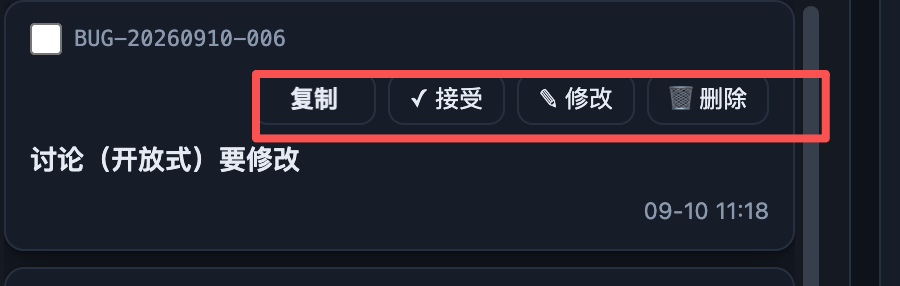

# BUG-20260910-007 这里的操作按钮去掉中文，全部用图标表示，然后移到和单号同行

- 状态：以看板机器状态为准（本文仅完善说明）。
- 归属：独立 Bug。
- 创建：2026-09-10T03:19:38.188Z

## 现象

看板列表卡片的「复制、接受、修改、删除」按钮带中文文字，并占据单号下方的独立一行；用户希望四个操作改为纯图标并与单号同行，以缩短卡片高度。原始截图中的卡片为 BUG-20260910-006，红框标出操作区。

代码核对：`scripts/web/app.js` 的 `reqRowEl` 在 `.card-top` 内输出单号与 `.row-acts`，待接受条目显示四个操作，其他状态保留复制；`copyIdBtnHtml` 输出「复制」，另外三个按钮分别输出「✓ 接受」「✎ 修改」「🗑 删除」。`scripts/web/style.css` 的 `.card-top` 允许换行，`.row-acts` 为不可拆分的按钮组，空间不足时整体落到下一行。因此截图表现与现有模板及样式相符；尚未进行浏览器复现，截图对应窗口宽度、缩放比例与运行版本均待确认。

## 复现步骤

1. 打开当前项目的 Status Board 看板列表，切换到「待接受」。准备一条已有待接受条目；不以实际接受或删除条目作为复现前提。
2. 观察卡片第一行的勾选框和单号，以及「复制、接受、修改、删除」操作区。
3. 调整列表可用宽度，使四个带文字按钮与单号不能同排，观察按钮组整体换到下一行。截图中的精确触发宽度待确认。
4. 对比期望：按钮应只有图标，并位于单号所在的同一条工具行，而非独立占据标题上方一整行。

## 期望行为

- 范围为看板列表卡片中的操作区；保留原有操作顺序及状态显隐规则。详情抽屉、全局工具栏、确认弹窗的文字不属于本次修改范围。
- 复制、接受、修改、删除均只展示可识别图标，不展示常驻中文按钮文字；悬停提示、键盘焦点提示和无障碍名称仍明确说明动作与对应单号。最终图标资源待开发阶段确认。
- 常规列表宽度下，勾选框、单号和右侧操作图标同一行垂直居中，标题独占下一行，原有时间与附属信息保持可读。已接受条目的完善徽标及其他提示仍能读取，不与图标重叠。
- 点击图标继续执行原有复制、接受、修改与删除流程，不额外触发整张卡片打开；键盘可聚焦并激活，焦点可见。删除继续保留现有确认与取消流程，图标化不降低误操作保护。
- 操作进行中保留防重复提交；成功、失败、禁用等反馈继续可感知。反馈不应把长文字塞回工具行导致重新换行，可由就近提示或原有通知承载。
- 窄容器下优先维持单号和操作在同一工具行，保证全部操作可访问且无页面级横向溢出。精确最小支持宽度及极窄宽度下的呈现策略待确认，不允许静默裁掉按钮或遮住单号。

## 界面展示

布局：卡片顶行左侧为勾选框与完整单号，右侧按「复制图标、接受图标、修改图标、删除图标」排列；标题在下一行，更新时间位于底部。原图用于说明问题，不作为修复后布局。

交互：悬停或键盘聚焦可辨认图标用途；复制反馈对应单号，接受、修改、删除延续原有流程；点击卡片空白区域仍打开详情。

状态反馈：正常显示可用图标；提交中禁用相应动作并反馈处理中；失败显示原因并允许重试；成功反馈后按实际状态更新卡片；空列表及列表加载/失败时沿用列表原有反馈，不显示虚假的可操作卡片。

- [交互演示（ui-demo.html）](./ui-demo.html)：切换「缺陷现象 / 修复后状态」——缺陷态四个带中文文字的按钮占单号下方独立一行；修复态纯图标操作与完整单号同一行。含图标悬停/聚焦提示、动作反馈、点击卡片空白打开详情；极窄宽度下图标换行策略待开发定案。

## 验收说明

- [ ] 在能容纳完整单号与四个图标的常规列表宽度下，待接受卡片四个操作均只有图标，且与单号同行；标题未被挤入工具行。
- [ ] 需求与 Bug 卡片均验证；其他状态仍按原资格显示操作，不因图标化多出接受、修改或删除入口。
- [ ] 四个图标均有准确可访问名称及用途提示，键盘能顺序到达并执行，焦点清晰；点击操作不会同时打开详情。
- [ ] 复制得到正确单号；接受、修改、删除的原有结果与确认/取消流程保持一致。使用可丢弃测试条目验证删除。
- [ ] 提交中不能重复触发；成功与失败可辨认，失败后可恢复操作；提示出现时不破坏同排布局。
- [ ] 验证长标题、附加徽标、深浅色及窄容器：不重叠、不裁掉操作、不产生页面级溢出；记录验证宽度和缩放比例。最小支持宽度待确认后补充验证。
- [ ] 空、加载、失败列表状态保持正确，未引入占位卡片操作入口。

## 关联（引入来源）

- 引入来源（修复归因，见 design.md）：REQ-20260910-006（经 `atb list` 核验存在）。该单将操作区定型为不可拆分整体并明确允许宽度不足时整体换到下一行、保留中文文案；中文文案更早来自 REQ-20260906-006（复制）与 REQ-20260906-020（✓ 接受）。
