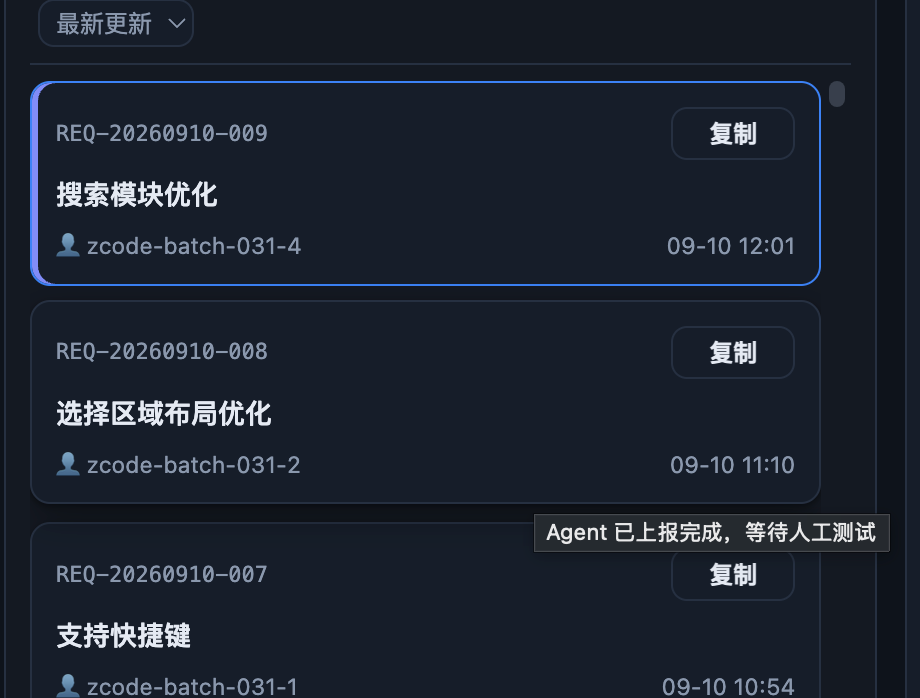

# BUG-20260910-010 待测试界面为什么会有这个紫蓝色边框？

- 状态：accepted（已接受，以看板 status.json 为准）
- 归属：独立 Bug（引入来源见 design.md）
- 创建：2026-09-10T04:34:02.131Z

## 现象

深色模式下（浅色同样存在，仅色值不同），需求模块列表中出现了用户无法理解的「紫蓝色边框」：

- 截图为「已计划」档列表（自上而下：REQ-20260910-011、BUG-20260910-008、REQ-20260910-012，排序「最新更新」），第一行 REQ-20260910-011 整卡带一圈**蓝色边框**（`--primary` 深色值 #3b82f6），且左缘内侧有一条 **3px 靛紫色竖条**（`--viewrail-accent` 深色值 #818cf8，`inset box-shadow`）。
- 同列表其他行没有此样式，界面悬停提示（title）只显示档位说明（如「已排入开发计划，开发启动后最旧优先处理」），**没有任何地方解释这个边框的含义**。
- 用户在测试界面（看板）时看到它，因其呈紫蓝色、与「待测试」档状态色（`--confirming`，深色 #a78bfa）视觉相近，被误读成状态/待测试相关标识，故提出本 Bug：「待测试界面为什么会有这个紫蓝色边框？」

### 原因定位（登记时排查结论，供开发阶段 design.md 展开）

边框不是状态标识，而是「详情抽屉当前打开行」的标记：

- `scripts/web/app.js` `reqRowEl()`：`el.className = \`req-row s-${it.status}${state.drawer.id === it.id ? ' picked' : ''}\``——抽屉当前展示的条目行会附加 `picked` class（截图右缘可见详情抽屉栏，当时抽屉正展示 REQ-20260910-011）。
- `scripts/web/style.css`：`.req-row.picked { border-color: var(--primary); box-shadow: inset 3px 0 var(--viewrail-accent); }`——蓝边 + 左缘靛条即由此而来。

问题点：

1. 该标记在界面内**零解释**（无提示、无图例），用户无从得知含义。
2. `--viewrail-accent` 按 REQ-20260906-001 约定是「视图切换栏专属强调色」，却被复用为列表行选中标记，色彩语义冲突；深色下与「待测试」档紫色（#818cf8 vs #a78bfa）极易混淆。
3. 刷新页面后视图快照（REQ-20260910-001）会恢复抽屉打开状态，边框「无操作也出现」，进一步强化「无来由」感。

## 复现步骤

1. 启动看板服务，浏览器打开 Web 界面（深色或浅色均可；截图为深色）。
2. 保证任一档位列表中至少有一条条目（有多条更易对照；本 Bug 截图场景为「已计划」档）。
3. 点击其中一条卡片，打开右侧详情抽屉。
4. 观察该卡片：整卡出现蓝色边框 + 左缘 3px 靛紫色竖条；同档其他卡片没有。
5. 悬停该卡片：提示仅为档位说明，不解释边框含义。
6. 直接刷新页面（Cmd+R）：因视图快照恢复抽屉，未进行任何操作边框依旧出现在同一卡片上。

## 期望行为

「详情打开中」的行标记不得以无来由、易与状态色混淆的形式出现，满足其一即可（最终方案在开发阶段 design.md 决策）：

1. 保留标记但让含义可被用户从界面获知：如悬停提示在档位说明之外补充「详情打开中（右侧抽屉正展示此条目）」，并用与六档状态色、视图切换栏强调色均可区分的中性样式呈现；
2. 或经设计评估后移除该边框标记（列表与抽屉的对应关系由抽屉自身内容表达）。

## 验收说明

- [ ] 按复现步骤操作，用户不读源码、仅凭界面即可说清边框含义（若保留），或边框不再出现（若移除）。
- [ ] 标记样式（若保留）在深浅色下均不与六档状态色混淆——尤其不被读成「待测试」相关；亦不再复用视图切换栏专属强调色 `--viewrail-accent`。
- [ ] 悬停提示（若保留）包含标记含义，且不影响原有档位说明与键盘导航。
- [ ] 无回归：关闭抽屉（✕ / Esc / 遮罩）后边框即时消失；刷新后边框与抽屉恢复状态一致；勾选行仍无主题蓝边框（REQ-20260908-027 口径不变）。

## 界面展示

- **界面布局**：顶部状态筛选条（六档 chips，附计数）；下方为「列表 + 详情抽屉」并排工作区（列表约 1/3 宽，抽屉占右侧），列表行卡片含单号、标题、元信息（下属 Bug 计数 / 时间）与行内操作区。
- **交互行为**：点击档位 chip 切换列表档位；点击卡片在右侧抽屉打开对应详情，再次点击其他卡片切换；关闭抽屉（✕ / Esc）后高亮消失；「模拟刷新」按钮可演示视图快照恢复抽屉后边框再度出现的场景。
- **状态反馈**：演示提供 正常 / 加载 / 空 / 失败 四态切换——正常态可交互复现边框；加载态显示「加载中…」；空态显示「当前筛选与搜索下没有条目。」；失败态显示错误提示与「重试」按钮（重试回到正常态）。另提供「缺陷现象 / 修复后示意」对照开关与深浅色切换，用于对比当前缺陷（无解释的蓝边+靛条）与期望方向（含义可见、不与状态色混淆的标记；具体样式以开发阶段设计为准）。

可交互演示：[./ui-demo.html](./ui-demo.html)（单文件、无外网依赖，浏览器直接打开）
