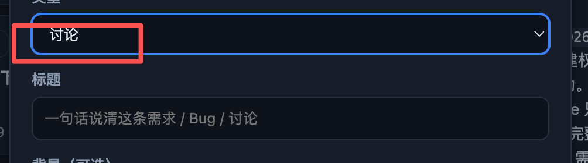

# BUG-20260910-013 新建条目中的讨论应该改为讨论（ASK）

- 归属：独立 Bug；机器状态以 status.json 为准。
- 创建：2026-09-10T07:18:16.273Z

## 现象

新建条目的「类型」下拉框中，讨论选项及选中值只显示「讨论」，缺少与其他类型一致的编号前缀说明。需求为「需求（REQ）」、Bug 为「Bug（BUG）」，讨论应显示「讨论（ASK）」。原始截图明确标出了缺失位置：

代码核对：`scripts/web/index.html` 的 `#fType` 当前包含 `<option value="ask">讨论</option>`；`scripts/web/app.js` 中 `syncNewFormFields` 按 `ask` 显示「背景（可选）」并隐藏截图区，创建时走 `/api/discussion`。这些是已核实事实；实际受影响浏览器和发布版本待确认。

## 复现步骤

1. 打开已初始化项目的 Status Board，进入「新建条目」面板。
2. 展开「类型」下拉框，对照需求和 Bug 的编号标识。
3. 选择「讨论」，观察下拉选项及收起后的选中值。
4. 当前结果：两处显示「讨论」，没有「（ASK）」。无需提交即可复现。

## 期望行为

- 新建面板内讨论类型的可见文案统一为「讨论（ASK）」，使用中文全角括号、英文大写 ASK；展开选项和收起选中值一致。
- 保持类型值 `ask` 及讨论创建语义；选中后仍显示「背景（可选）」、隐藏截图区，标题必填、背景可空。
- 正常、空标题、创建中及创建失败时类型文案保持一致，原有表单校验与提交反馈继续可用。
- 本项范围是新建面板的类型选项；其他讨论入口、标题占位说明是否需要同样带 ASK 待确认，不将它们纳入本项必改范围。

## 界面展示

[打开可交互演示](./ui-demo.html)。演示为离线单文件，提交仅模拟，无项目写入。

- 布局：右侧新建面板，按类型、标题、背景排列，底部取消/创建按钮；左侧提供缺陷与期望切换及状态选择。移动窄屏上下排列。
- 交互：切换缺陷/期望比较「讨论」与「讨论（ASK）」；展开下拉框或切换需求/Bug/讨论，观察描述与截图占位区域联动；输入标题后模拟创建，取消可清空表单。
- 状态反馈：正常允许填写；空状态清空标题并提示必填；加载状态显示「创建中…」并禁用提交；失败状态保留输入并允许重试。成功只展示模拟反馈，不代表真实后端创建成功。
- 演示状态按钮用于验收场景切换，不要求添加到产品界面。

## 验收说明

- [ ] 展开类型列表及选择后收起时，讨论都准确显示「讨论（ASK）」；需求和 Bug 原有文案保持一致。
- [ ] 键盘选择讨论后读到的选项名称包含 ASK，类型实际值仍为 `ask`。
- [ ] 切换三种类型时字段联动正常；讨论背景可空、截图区隐藏，空标题仍不能创建。
- [ ] 讨论创建仍调用既有讨论接口；成功进入讨论展示流程，加载防重复提交，失败保留输入并可重试；这些作为既有行为回归验证。
- [ ] 当前 `scripts/tests/workbench-layout.test.mjs` 有要求精确显示「讨论」的旧断言，开发时应按本项新文案更新对应断言；本轮仅完善文档，不调整测试源码。
- [ ] 本地打开演示可切换缺陷/期望及正常/空/加载/失败，无外网请求或构建步骤。

## 关联（引入来源）

未定位。已查看新建面板模板、字段联动和讨论提交分支及布局测试；测试中引用旧文案约定不构成引入来源确认。具体引入提交与源单待开发阶段核实。
