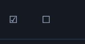

# BUG-20260910-017 全选和全不选的图标尺寸要跟其他操作图标按钮的样式一样

- 状态：以 status.json 与看板实时状态为准（本文仅完善说明）
- 归属：独立 Bug（引入来源见文末「关联」）
- 创建：2026-09-10T12:59:53.420Z

## 现象

需求列表头单行工具栏（`#reqCaption`）左起前两个图标按钮——「全选」（☑，`#selectOperable`）与「全不选」（☐，`#selectNone`）——在界面上的视觉尺寸明显大于列表卡片操作区的其他操作图标按钮（⧉ 复制；待接受条目另有 ✓ 接受 / ✎ 修改 / 🗑 删除），两组按钮同屏出现时大小不统一、观感突兀。

代码核对（截图与现状相符的依据）：

- `scripts/web/index.html` 第 122-123 行：两按钮内容为 `☑` / `☐` 字形，class 均为 `btn small quiet icon-act`（REQ-20260910-026 图标化产物）。
- `scripts/web/style.css` 第 376 行：`.req-caption .btn.icon-act { padding: 3px 5px; font-size: 13px; line-height: 1; min-width: 26px; min-height: 24px; text-align: center; }`；第 470 行 `.req-row .row-acts .btn.icon-act`（卡片操作图标口径，BUG-20260910-007 定型）数值与之**完全一致**（同为 min-width 26px / min-height 24px / font-size 13px）。
- 即 CSS 盒规格两处相同，视觉偏大来自**字形本身的渲染差异**：☑（U+2611）/ ☐（U+2610）投票框字形在系统字体回退渲染下接近满 em 见方，而 ✓（U+2713）/ ✎（U+270E）/ ⧉（U+29C9）在同一 13px 字号下实际渲染的视觉高度明显更小——同样字号下 ☑ / ☐ 看起来更大。不同操作系统 / 浏览器 / 深浅色主题的字体回退链不同，偏差幅度与截图对应的具体运行环境待确认（原截图为深色主题，两图标位于列表分隔线上方，与工具栏位置吻合）。

## 复现步骤

1. 启动 Status Board 服务（`scripts/server.mjs`，默认端口 8888）并在浏览器打开看板；深浅色主题均可复现（原截图为深色）。
2. 准备（或确认已有）任一可选择档的条目：待接受 / 已接受 / 已计划（非选择档不显示选择控件，无法复现本现象）。
3. 顶部切换到该可选择档，观察列表头工具栏左起前两个图标按钮：☑（全选）、☐（全不选）。
4. 观察任一列表卡片首行右侧的操作图标按钮：⧉（复制单号，各状态均有）；待接受条目另有 ✓（接受）/ ✎（修改）/ 🗑（删除）。
5. 对比两组图标：☑ / ☐ 字形明显大于 ⧉ / ✓ / ✎ / 🗑，与「其他操作图标按钮」的既定样式不统一。截图对应的窗口宽度、系统缩放与运行版本待确认，不影响肉眼判定结论。

## 期望行为

- 「全选 / 全不选」图标的**视觉尺寸与样式**和列表卡片其他操作图标按钮（⧉ / ✓ / ✎ / 🗑，BUG-20260910-007 的 `.btn.icon-act` 图标口径）一致：同一界面内两组图标的视觉高度、占位观感统一，☑ / ☐ 不再明显偏大。实现手段（单独缩小 ☑ / ☐ 的字号、更换为视觉重量相当的字形、或改用内联 SVG 对齐既有图标口径）**待开发阶段确认**，本文只约束结果、不预设方案；`scripts/tests/caption-toolbar-icons-20260910-026.test.mjs` 中关于尺寸规则的断言若因方案调整需同步修正，属开发阶段事项。
- 仅改图标视觉呈现：按钮的 `type=button`、`aria-label="全选"/"全不选"`、`title` 悬浮提示等语义契约不变（图标化契约沿用 REQ-20260910-026）。
- 功能行为零变化：全选仅勾选当前筛选档内可见的可操作条目（叠搜索范围，REQ-20260908-027）；全不选仅取消当前档勾选、其他档保留（BUG-20260907-016 契约）；零勾选禁用全不选、无可操作项禁用全选；任一批量操作进行中两者防误触禁用；非选择档（开发中 / 待测试 / 已完成）两按钮整体隐藏（BUG-20260909-008）。
- 工具栏布局不回退：常规宽度单行结构（REQ-20260910-008）、批量动作组与「▶ 开始完善 / ▶ 开始开发」恒定同行（REQ-20260910-026）、窄宽度不横向滚动不裁切等口径全部保持。

## 界面展示

- 布局：列表头工具栏左起为全选 ☑、全不选 ☐ 两个等宽图标按钮，其后为「已选 N 项」计数与当前档批量动作，快捷入口靠右；列表卡片首行右侧为 ⧉ / ✓ / ✎ / 🗑 操作图标。修复后 ☑ / ☐ 与卡片操作图标视觉尺寸一致（演示中的修复后字号为示意，最终方案待开发确认）。
- 交互：可切换「缺陷现象 / 修复后（示意）」对照两种形态；可实际点击勾选、全选（仅当前档可见可操作项，叠搜索范围）、全不选（仅清当前档，其他档保留）；批量按钮按档显隐，进行中变「接受中… / 移出中…」并禁用全选 / 全不选 / 复选框；可切换待接受 / 已接受 / 已计划 / 开发中档位（非选择档无选择控件）。
- 状态反馈：正常——计数即时更新、零选择时批量动作组隐藏；空——列表空态说明、全选禁用；加载——列表加载中、选择控件禁用；失败——结果区显示逐条失败清单（`编号：错误信息`）且部分成功口径保留；另含深 / 浅色主题切换（原缺陷在两种主题下均可见）。

[打开可交互演示](./ui-demo.html)。单文件离线演示，对照呈现缺陷现象（☑ / ☐ 字形明显大于卡片操作图标）与期望修复后状态（两组图标视觉尺寸统一，修复参数为示意）；演示数据与加载 / 失败反馈均为模拟，不写入看板。

## 验收说明

- [ ] 任一可选择档（待接受 / 已接受 / 已计划）下，工具栏 ☑ / ☐ 图标的视觉尺寸与卡片操作图标（⧉ / ✓ / ✎ / 🗑）一致，深浅色主题下分别目视验证；记录验证环境（操作系统 / 浏览器 / 窗口宽度 / 缩放），因字体回退链差异，跨环境偏差幅度如仍存在须如实记录。
- [ ] 图标语义契约保持：`aria-label` / `title` / `type=button` 不变，键盘可 Tab 到达、焦点轮廓可见，屏幕阅读器仍念出「全选 / 全不选」。
- [ ] 功能零回归：全选仅勾当前档可见可操作项（叠搜索范围）、全不选仅清当前档且其他档保留、零勾选禁用全不选 / 无可操作项禁用全选、批量进行中防误触、非选择档两按钮整体隐藏。
- [ ] 工具栏布局不回退：常规宽度单行、批量动作组与快捷入口恒定同行、窄宽度无横向滚动与裁切（REQ-20260910-008 / 026 口径）。
- [ ] 既有回归测试语义通过：`scripts/tests/caption-toolbar-icons-20260910-026.test.mjs`（含 T2 尺寸规则断言，方案若调整字号 / 改 SVG 需同步修正断言）及 `caption-toolbar-20260910-008` / `selection-lane-scope` / `selection-bar-merge` 等。
- [ ] ui-demo.html 可离线直接打开：无外网依赖、无构建步骤，可操作缺陷 / 修复对照、档位与状态切换、全选 / 全不选及批量动作。

## 关联（引入来源）

- 引入来源（经 `atb list` 核验存在）：REQ-20260910-026——该单将「全选 / 全不选」从带文字按钮改为仅 ☑ / ☐ 字形的图标按钮（2026-09-10），沿用 BUG-20260910-007 的 `.btn.icon-act` CSS 盒口径但未对齐字形视觉重量，本缺陷随之引入。图标口径参照 BUG-20260910-007（卡片操作区统一小方格）。
- design.md 的根因分析 / 方案 / 风险留待开发阶段补充。
