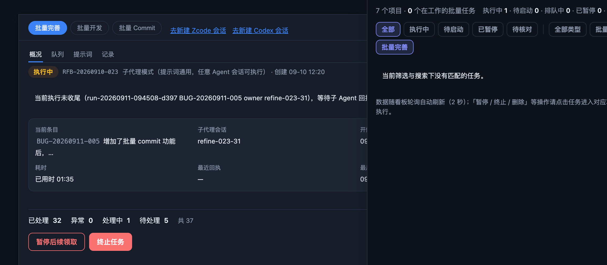

# BUG-20260911-007 明明存在批量完善队列在执行中，但是在全局任务界面却没有显示，请定位

- 归属：独立 Bug（引入来源登记于 design.md，开发阶段归因）
- 创建：2026-09-11T01:47:32.709Z
- 当前状态以系统记录为准；本文不维护状态。
- 关联：REQ-20260910-003（全局任务看板）、BUG-20260910-004（全局任务改为顶栏入口 + 右侧面板）、BUG-20260907-017（服务常驻进程与静态前端版本不一致的先例，本单候选根因方向）、BUG-20260911-006（全局聚合缺批量 Commit 任务——那是聚合**口径缺失**、必现；本单是口径内的批量完善批次**该显示而未显示**，性质不同，勿混同）。

## 现象

截图时刻（2026-09-11 09:47 前后，北京时间）同屏呈现互相矛盾的两半：

- 左侧（项目内任务模块「批量完善」页签）：批次 RFB-20260910-023 正常显示为「执行中」，计数「已处理 32 · 异常 0 · 处理中 1 · 待处理 5 · 共 37」，当前项为 run-20260911-094508-d397（BUG-20260911-005，子代理会话 refine-023-31）——队列确在执行。
- 右侧（顶栏「全局」打开的全局任务面板）：汇总行显示「7 个项目 · **0 个在工作的批量任务**」，但状态分项又有「**执行中 1** · 待启动 0 · 排队中 0 · 已暂停 0 · 待核对 …」；状态筛选「全部」+ 类型筛选「批量完善」+ 搜索框为空时，列表区显示「当前筛选与搜索下没有匹配的任务」——执行中的完善批次没有对应任务行。

即：**全局面板的汇总计数承认存在 1 个执行中任务，但任何筛选档下都看不到它；项目内面板却能看到同一批次在执行**。跨项目总览对该执行中的批量完善批次出现盲区。

由前端渲染逻辑可对截图态做如下反推（依据见下节代码行号）：

- 「当前筛选与搜索下没有匹配的任务」仅在 `hasTasks === true`（聚合返回里确有任务）且筛选后为空时出现；汇总「执行中 1」也说明返回数据里存在 `status === 'running'` 的任务行。
- 状态筛选为「全部」、搜索为空时该任务仍被滤掉，唯一剩下的过滤维度是类型筛选 `t.kind === 'refine'`——**当时聚合返回的那个 running 任务行的 `kind` 不等于 `'refine'`（或字段缺失），而执行中的 RFB-20260910-023 并未出现在返回的任务行中**（否则「全部 + 批量完善」下必显示）。

## 已核实的代码与数据（2026-09-11 完善时）

- 服务端聚合链路：`GET /api/batch/global`（`scripts/server.mjs` 约 2030-2032 行）→ `aggregateGlobalTasks()`（约 303-335 行，逐项目容错；项目目录缺失 / 批次账本 JSON 损坏时该项目降级为错误行而非静默空）→ `projectTaskRows()`（约 283-300 行）：批量开发 `batch.unfinishedBatches` + 批量完善 `refine.unfinishedRefineBatches`（各过滤已终止 aborted），逐批生成只读简报并补 `queued`（非队首 prepared）标记。
- 简报结构：批量完善简报 `refineBatchBrief`（`scripts/lib/refine-store.mjs` 约 1331-1351 行）**硬编码 `kind: 'refine'`**、透传账本 `status`；批量开发简报 `batchBrief`（`scripts/lib/batch.mjs` 约 1162-1182 行）`kind: 'develop'`。`unfinishedRefineBatches`（refine-store.mjs 约 387-393 行）口径为 `status !== 'finished'`。
- 前端链路：`renderGlobalView()`（`scripts/web/app.js` 约 4498-4577 行）过滤链 = 状态档（`globalTaskStatusKey`，约 4386-4389 行）+ 类型档（`GLOBAL_KIND_FILTERS`，约 4378-4383 行，仅 develop / refine 两键）+ 搜索（`globalTaskMatches`，约 4415-4420 行）；汇总行 `globalSummaryText()`（约 4443-4451 行）**不依赖 kind**，按未筛选全量任务计数；「0 个在工作的批量任务」计数 `taskTotal` 是**筛选后**的匹配数——两者口径不同，这正是「执行中 1 与 0 匹配」能同屏出现的机制缝隙。数据由 `refreshGlobal()`（约 4424-4441 行）在面板打开时拉取并随主轮询（约 1882 行）刷新。
- 账本实测：`docs/agent-team-board/refine/batches/RFB-20260910-023/batch.json` 当前 `status: "running"`、`aborted: false`、candidates 38；截图时刻其前序 run（run-20260911-094508-d397）已于 09:45:08 在途——账本侧无「不该显示」的理由（非 finished、非 aborted）。
- 项目注册实测：`~/.agent-team-board/projects.json` 注册 7 个项目，本仓库根 `/Users/adichou/Documents/src/agent-team-board` 为首位——非「项目未注册导致不聚合」。
- 接口实测（2026-09-11 09:59，本机运行中的看板服务）：`GET /api/batch/global` 返回正常——本仓库项目行含 RFB-20260910-023（`kind: "refine"`、`status: "running"`、`current` 为正在运行的完善条目），其余项目 tasks 为空。**按当前代码与当前数据，「全部 + 批量完善」筛选下应显示该任务行；完善时未能复现截图现象。**
- 版本不一致先例（BUG-20260907-017，`scripts/server.mjs` `/api/health` 注释）：看板服务为常驻进程、**路由集在启动时固化**，静态前端却实时读盘——代码更新后旧服务进程可能缺少新接口或返回旧口径数据。若截图时刻服务进程旧于前端（简报缺 `kind` 字段或口径不同），恰好能拼出「汇总按 status 计数（不依赖 kind）显示执行中 1、类型筛选按 kind 匹配失败」的截图态。是否属实**待确认**（该假设与当前实测不复现相容，但无当时服务版本记录可证）。

## 复现步骤

原始场景（按截图记录）：

1. 启动 Status Board（`node scripts/server.mjs`，默认端口 8888；或 Electron `npm run app`），确认项目已注册（顶栏项目选择器可见）。
2. 在某项目（本例 agent-team-board）创建批量完善批次并派发执行：批次进入「执行中」（有子代理领取条目在途，批次账本 `status: "running"`、未终止）。项目内「任务」模块 →「批量完善」页签可看到该批次执行中及当前条目。
3. 点击顶栏「管理项目」右侧的「全局」按钮打开全局任务面板。
4. 状态筛选选「全部」、类型筛选选「批量完善」、搜索框留空。
5. 观察（缺陷态）：汇总行出现「执行中 1」但「0 个在工作的批量任务」，列表区显示「当前筛选与搜索下没有匹配的任务」——看不到步骤 2 那个执行中的完善批次行；而项目内面板同屏能看到它。
6. 对照：把类型筛选切到「全部类型」/「批量开发」、状态档逐档切换、搜索批次号 `RFB-…`，确认任务行在任何档位下均未出现（截图时刻观察结果）。

完善时复现尝试（2026-09-11，未复现）：

1. 同一环境（RFB-20260910-023 仍在执行中）打开全局任务面板，「全部 + 批量完善」下任务行正常显示（当前项、计数、时间齐全），汇总「执行中 1」与列表一致。
2. 直连 `GET /api/batch/global` 核对：返回含该批次（`kind: "refine"`、`status: "running"`）。
3. 即：按现行代码与当前数据无法再触发；截图时刻的成因（候选：服务常驻进程旧版本返回缺 `kind` / 旧口径简报；或其他项目同类干扰 + 完善批次瞬时缺失）**待开发阶段定位归因**，禁止编造结论。

## 期望行为

- **口径内必显示**：某项目存在未收尾且未终止的批量完善批次（待启动 / 排队中 / 执行中 / 已暂停 / 待核对）时，全局任务面板必须在对应项目分组下出现该任务行：状态 chip、类型徽标「批量完善」、批次号（RFB-…）、当前条目（编号 / 标题 / 子代理会话；无在途项显示待启动引导文案）、计数行（已完成 / 异常 / 待处理 / 共 N）、创建与活动时间，并随轮询自动更新。
- **汇总与列表一致**：不得出现「汇总显示执行中 N（N ≥ 1）而 状态=全部 + 对应类型筛选下 0 匹配」的自相矛盾态。同一数据快照内，凡计入汇总的任务行必须能通过「全部状态 + 全部类型」筛选被展示。
- **不静默丢失**：聚合返回中 `kind` 缺失或取值不在已知词表内的任务行（如旧服务进程的简报），前端应能兜底展示（例如按批次号前缀 RFB- 归类批量完善、未知类型给中性徽标），并在行内留可发现的诊断线索；不得因字段口径不一致而使任务行从任何筛选档位下消失。兜底的具体口径（前缀推断 vs 服务端保证 kind 必填 + 前端容错）**待确认**，开发阶段定。
- **定位结论落档**：修复时须在 design.md「引入来源 / 根因分析」写明截图时刻任务未显示的真实成因（服务进程版本、返回数据形态或瞬态），并给出防再发措施（如 `/api/health` 版本自检提示重启、前端对异常简报的告警）。
- 既有行为不回归：批量开发任务展示、点击行 /「进入项目任务」跳转该项目任务模块对应页签、点击当前条目打开条目抽屉、面板只读（无创建 / 暂停 / 终止写入口）、空态 / 加载骨架 / 单项目读盘失败错误行等状态均保持。

## 界面展示

[打开交互演示](./ui-demo.html)（离线单文件，全部数据为模拟，不调用服务）。

- 布局：模拟看板顶栏（项目选择器、「管理项目」、「全局」入口）+ 主工作区占位 + 右侧全局任务面板（标题与关闭、搜索、汇总行「N 个项目 · M 个在工作的批量任务 · 执行中 x …」、状态 / 类型筛选 chips、按项目分组的任务行），并附演示控制条（标注「非产品 UI」）。
- 交互：「缺陷现象 / 期望修复」模式对照——同一份模拟数据（agent-team-board 项目下执行中的 RFB-20260910-023），缺陷模式复现截图矛盾（汇总「执行中 1」但「全部 + 批量完善」0 匹配、切「全部类型」出现类型徽标空白的行），期望模式任务行正常显示、筛选命中、点击行 / 条目编号模拟跳转（toast 仅提示导航）；另有批次状态切换（待启动 / 执行中 / 已暂停 / 收尾移出）观察汇总与列表联动、场景切换（正常 / 空 / 加载 / 失败）、深浅色主题。
- 状态反馈：正常——任务行完整信息 + 「自动刷新」按钮模拟 2 秒轮询语义；空——无注册项目空态卡；加载——骨架占位行；失败——错误条「正在随轮询自动重试」并保留上一次数据；筛选无匹配——「当前筛选与搜索下没有匹配的任务」提示；缺陷模式另标注汇总与列表矛盾点。

## 验收说明

- [ ] 在某项目存在执行中（或待启动 / 排队中 / 已暂停 / 待核对）的批量完善批次时打开全局任务面板：对应项目分组下出现该任务行，状态 / 类型徽标 / 批次号 / 当前条目 / 计数 / 时间齐全，并随轮询（2 秒语义）自动更新。
- [ ] 汇总行与列表不再矛盾：出现「执行中 N（N ≥ 1）」时，「全部状态 + 批量完善」筛选下至少显示那 N 个执行中的完善批次行；「全部状态 + 全部类型」下显示所有计入汇总的任务行。
- [ ] 人为构造 `kind` 缺失 / 未知 kind 的简报数据（模拟旧服务进程口径）：任务行仍以兜底形态显示（不静默消失），行内可见诊断线索；不因字段口径不一致而 0 匹配。兜底口径以开发阶段确定的方案为准（前缀推断或服务端保证必填）。
- [ ] 批量开发任务、无任务项目、无注册项目空态、加载骨架、单项目读盘失败错误行、搜索与各筛选档、行内跳转（进入项目任务 / 打开条目抽屉）等既有行为不回归；面板保持只读。
- [ ] 修复时在 design.md 登记根因归因（三选一，禁止编造）与防再发措施；若归因为服务进程版本不一致，`atb serve` / `/api/health` 的版本自检与重启提示应覆盖该场景（对照 BUG-20260907-017 机制）。
- [ ] 本演示页仅用于界面验收讨论，不代表修复已实现；真实联调用隔离测试仓库核对全局显示值与项目内面板 / 账本一致。

## 待确认

- 截图时刻任务行未显示的真实成因：服务常驻进程旧于前端（简报缺 `kind` / 旧口径）为当前最相容假设，但无当时服务版本记录可证；也可能与其他项目当时在途的批量开发批次 + 完善批次瞬时缺失叠加有关——待开发阶段定位，登记入 design.md。
- 兜底口径的具体形态：按批次号前缀（RFB- → 批量完善）推断类型，还是服务端保证 `kind` 必填并由前端对未知值给中性徽标 + 告警——待定。
- 是否与 BUG-20260911-006（全局聚合纳入批量 Commit）合并处理：同属全局聚合的一致性范畴，建议一并排期，待定。
- 「待核对」（needs_attention）档对完善批次的判定沿用现有 refine 词表口径，不因本单调整——如有变化另行登记。
