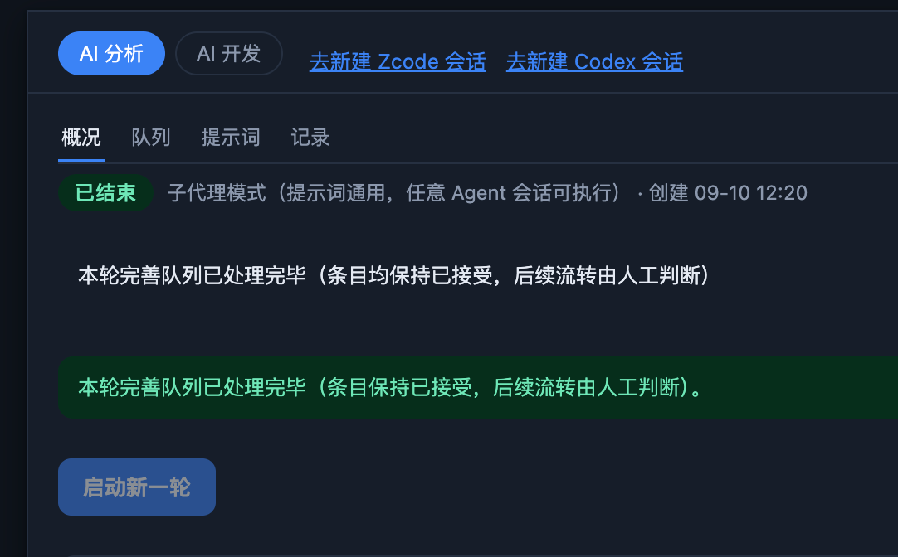

# BUG-20260914-001 AI 分析任务中重复显示了“本轮完善队列已处理完毕（条目均保持已接受，后续流转由人工判断）”，请修复

- 状态：submitted（待人工接受）
- 归属：独立 Bug（引入来源见 design.md）
- 引入来源：REQ-20260907-003（引入完善面板 renderRefinePanel：概况页同时渲染服务端 notice 透传与本地硬编码收尾 ok 条，正常收尾态二者语义重叠导致重复；「均」字/句号差异系后续 REQ-20260913-003 重定文案时两处未对齐所致）
- 创建：2026-09-14T02:00:17.005Z

## 现象

看板「AI 分析」页 → 概况页签中，完善任务正常收尾（状态徽章「已结束」、剩余 0）后，同一语义的收尾提示**连续出现了两条**：

1. 第一条：普通样式提示（无边框高亮），文案为「本轮完善队列已处理完毕（条目**均**保持已接受，后续流转由人工判断）」（无句号）；
2. 第二条：绿色成功提示框（notice ok），文案为「本轮完善队列已处理完毕（条目保持已接受，后续流转由人工判断）。」（无「均」、带句号）。

即：不仅重复显示，两条文案措辞还不一致（「均」字与句号有无）。

定位线索（供开发阶段归因，已对照源码核实）：

- `scripts/lib/refine-store.mjs` `checkRefineBatch()`：`remaining === 0` 时生成 notice「本轮完善队列已处理完毕（条目均保持已接受，后续流转由人工判断）」（约 1179 行）；
- `scripts/server.mjs` `/api/refine/current` 将该 notice 以 `notice` 字段透传给前端；
- `scripts/web/app.js` `renderRefinePanel()` 概况页：
  - `${data.notice ? `
${esc(data.notice)}
` : ''}` 渲染了服务端 notice（第一条来源）；
  - `batchDone && !b.aborted` 时又硬编码渲染 `
本轮完善队列已处理完毕（条目保持已接受，后续流转由人工判断）。
`（约 6179 行，第二条来源）。
- 批次收尾时两个条件同时成立（`notice` 非空 + `batchDone` 为真），两条同时渲染 → 重复。

## 复现步骤

1. 看板中存在至少 1 个「已接受未完善」条目（AI 分析候选非空；若无，先新建需求/Bug 并接受）。
2. 打开 Agent Team Board 看板界面（Electron 桌面端或 Web 端均可），切到「AI 分析」一级页签。
3. 点击「启动」：创建完善任务并复制主调度提示词。
4. 在任意 Agent 会话粘贴执行该提示词：子代理依次领取候选条目补全文档并 `refine done` 回执，直至全部候选处理完毕（剩余归零），批次状态转为「已结束」。
5. 回到看板「AI 分析」→ 概况页签（或等待前端轮询自动刷新）。

**实际结果**：概况页提示区上下紧挨着渲染了两条「本轮完善队列已处理完毕（…）」——一条普通样式（含「均」、无句号，来自服务端 `notice`），一条绿色成功框（无「均」、带句号，来自前端 `batchDone` 硬编码）。

**备注**：无需特殊时序；只要批次正常收尾且未终止，每次进入概况页/轮询重渲染均稳定复现。终止（aborted）路径不会出现（前端 ok 条有 `!b.aborted` 守卫，但服务端 notice 走终止文案，语义不同不构成重复）。

## 期望行为

- 批次正常收尾（finished、未终止、剩余 0）时，「本轮完善队列已处理完毕（条目保持已接受，后续流转由人工判断）」这条收尾语义**只出现一次**（保留绿色成功提示样式的展示口径），不再与服务端 `notice` 叠加重复渲染。
- 两处文案统一为同一措辞（含「均」字与句读的一致），消除同屏两条文案不一致的问题。
- 其余场景的 notice 展示不回归：运行中「当前执行未收尾…」、暂停、终止等提示仍按现状单条展示。
- CLI `atb refine check` 输出的 notice 调度协议语义不受影响（该 notice 同时服务 CLI 主调度核对，修复应只收敛看板 UI 的展示口径，不改动 CLI 行为——具体方案由开发阶段 design.md 确定）。

## 验收说明

1. **重复消除**：按复现步骤跑完一轮完善任务，进入「AI 分析」→ 概况页，「本轮完善队列已处理完毕（条目保持已接受，后续流转由人工判断）」整句在页面中只出现 1 次。
2. **文案统一**：修好后展示的唯一一条收尾提示与 CLI `atb refine check` 返回的 notice 文案一致（同措辞、同句读）。
3. **轮询稳定**：前端轮询触发重渲染（`sig` 变化）或手动刷新页面后，仍只显示 1 条收尾提示，不闪现两条。
4. **场景不回归**：
   - 批次执行中（存在在途执行）时概况页显示「当前执行未收尾（…），等待子 Agent 回执后核对」单条提示；
   - 人工终止批次显示「任务已人工终止…」单条 warn 提示（且不再出现 ok 收尾条）；
   - 暂停批次显示「已请求暂停后续领取…」单条 info 提示；
   - 「启动新一轮」按钮在收尾态仍正常展示与可用。
5. **回归测试**：现有自动化测试（`node scripts/tests/run-all.mjs`）全量通过；如修复涉及渲染逻辑，补充对应断言（收尾态概况页该文案仅出现一次）。

## 界面展示

**界面布局**：看板顶部为一级页签（「AI 分析」当前选中、「AI 开发」）及右侧「去新建 Zcode / Codex 会话」入口；AI 分析页内为二级页签（概况 / 队列 / 提示词 / 记录，记忆当前分区）。概况页自上而下：批次状态行（「已结束」状态徽章 + 模式与创建时间）、提示区（本 Bug 缺陷所在：收尾时重复渲染两条「本轮完善队列已处理完毕…」）、「启动新一轮」按钮、元信息网格（当前条目 / 子代理会话 / 开始时间 / 耗时 / 最近回执 / 最后活动）、任务统计行与操作按钮（暂停/终止）。

**交互行为**：一级/二级页签点击切换；「启动新一轮」在有候选时可点、无候选时禁用并说明原因；「重新复制」可重取调度提示词；条目编号为链接，点击跳转对应条目。缺陷本身无需交互即可见——收尾态进入概况页即呈现重复提示。

**状态反馈**：正常收尾（本 Bug 场景）显示收尾提示 + 「启动新一轮」；运行中显示「等待领取下一项 / 当前执行未收尾…」提示与统计行实时计数；空候选启动区显示「暂无可完善候选…」notice；终止显示红色 warn 提示并隐藏 ok 收尾条；暂停显示 info 提示；刷新/轮询重渲染后各状态提示保持单条、稳定。

**可交互演示**：[./ui-demo.html](./ui-demo.html)——单文件、无外网依赖，浏览器直接打开。内含「缺陷现状 / 修复后」对照开关与状态切换（正常收尾 / 运行中 / 暂停 / 终止 / 空候选），直观呈现重复提示缺陷与期望的修复后效果。
