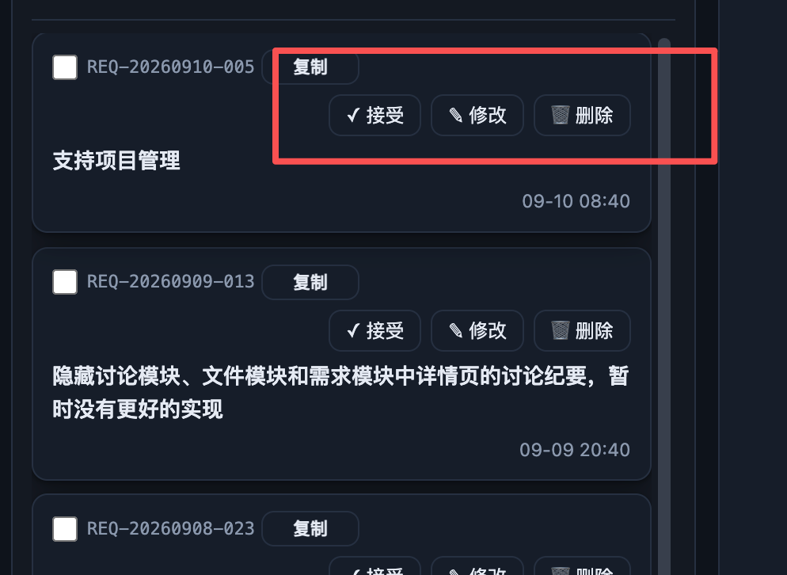

# REQ-20260910-006 布局优化，列表的操作按钮要平铺在一行内

- 创建：2026-09-10T00:41:25.783Z
- 状态以看板机器记录为准，本文不维护状态副本。

## 描述

原始诉求：截图中红圈部分要优化在一行内。

需求列表卡片中的「复制、接受、修改、删除」应组成连续的单行操作区，避免复制在上一行、其余按钮在下一行造成卡片变高和视觉分散。此次完善定义展示目标，不改变各按钮的业务规则，也不扩展操作权限。

### 已核实的现状与范围

`scripts/web/app.js` 的 `reqRowEl` 在 `.card-top` 渲染选择框、包含复制按钮的 `itemIdHtml`、可选徽标及 `.row-acts`；接受、修改、删除只在 submitted 条目出现。`scripts/web/style.css` 的 `.card-top` 允许换行，`.item-id` 则不换行，与截图表现相符。

范围为需求模块列表行及其不同状态下现有操作的排布，不涉及详情抽屉、任务模块或新增业务操作。非 submitted 条目继续遵守原有按钮显隐规则；不因本需求重新显示接受、修改或删除。

### 界面布局

- 卡片保留顶部信息与操作、下方标题、底部时间等元信息的层次。选择框及完整单号位于信息区，操作区按「复制、接受、修改、删除」顺序横向排列，按钮等高、间距一致、文字不折行。
- 空间充足时信息区与操作区同排；宽度不足时允许整个操作区移至下一行，但四个按钮必须始终同排，不将复制单独留在上一行。徽标可随信息区自然排布，不插入按钮之间。
- 极窄容器下操作区允许局部横向滚动，完整保留全部按钮和焦点可达性，不裁切按钮、不覆盖标题、不使整个页面横向溢出。不要求信息、完整单号与全部操作强制挤在同一行。
- 长标题正常换行，不能推动按钮内部换行或与操作区重叠。具体断点、像素尺寸与是否需覆盖其他列表：待确认，开发时以实际容器宽度和已有样式验证。

### 交互行为

- 复制、接受、修改、删除仍触发现有对应行为；操作按钮和选择框点击不冒泡打开条目详情，点击卡片其他可用区域仍可打开详情。
- 保留现有接受流程、编辑内容及删除确认语义；此次不定义新的确认流程。键盘 Tab 可依次到达操作按钮，Enter/空格可触发，焦点可见。
- 复制反馈文案变长或操作请求进行中时，操作区仍保持单行；请求中按原有规则禁用相关操作，防止重复提交。失败后恢复可操作状态，重试继续作用于原条目。

### 状态反馈

- 正常：按条目状态显示已有可用按钮；成功反馈沿用现有机制，例如复制显示「已复制 ✓」。
- 空：列表无条目时展示明确空态，不显示无归属的操作按钮。
- 加载：列表读取中显示加载提示；操作请求中显示处理中反馈，避免重复点击。
- 失败：读取失败显示错误与重试入口；操作失败保留条目并显示失败提示，恢复相关操作，不误报成功。
- 状态切换不应产生按钮重叠、文本截断或操作区内部换行。

### 界面展示

[打开单文件交互演示](./ui-demo.html)。演示按上述布局组织信息区、单行操作区、标题与时间，提供容器宽度、条目状态和正常/空/加载/失败切换；点击复制、接受、修改、删除可查看模拟交互和状态反馈。窄宽度下整个操作区换行或局部滚动，四按钮不拆开。

演示只修改内存，不调用项目接口；按钮操作和错误模拟用于评审排布，不能作为业务已实现的证明。正式产品沿用现有权限、确认框和业务反馈。

## 验收标准

- [ ] 截图对应的 submitted 列表卡片中，复制、接受、修改、删除按固定顺序同排，不再出现复制单独一行、其他操作另一行。
- [ ] 在宽、中、窄容器（演示参考 760/480/320px，最终断点待确认）检查：允许操作区整体换行，按钮内部及按钮之间不换行；极窄时可局部滚动访问全部操作，无页面级横向溢出及内容重叠。
- [ ] 完整单号可阅读；长标题、多行标题及徽标存在时，标题与元信息层次保持清晰，按钮不被挤压成不可读状态。
- [ ] 非 submitted 条目的按钮显隐与现有规则一致，布局调整不新增接受、修改、删除权限。
- [ ] 分别操作复制、接受、修改、删除及选择框，不意外打开详情；点击卡片其他可用区域仍打开正确条目，原有确认/编辑流程可正常完成或取消。
- [ ] 复制成功反馈及请求加载/失败/恢复过程中，单行操作布局保持稳定；重复点击防护有效，失败后可重试且不会误报成功。
- [ ] 列表正常、空、加载、失败四态均有可辨识反馈，失败提供重试；空态和加载态无可误操作的条目按钮。
- [ ] Tab 顺序与视觉顺序一致，按钮有可辨识名称和可见焦点，键盘可操作；窄宽度滚动不妨碍访问末尾按钮。
- [ ] `ui-demo.html` 可直接离线打开，CSS/JS 内联，无外网和构建依赖；宽度、条目状态、四种列表状态和操作反馈均可交互验证。
