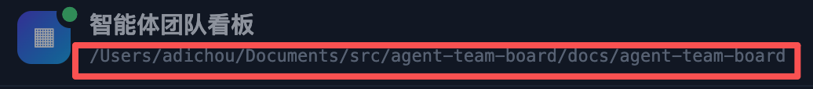

# REQ-20260910-012 app 版的布局优化

- 状态：accepted（已接受；以 status.json 为准）
- 创建：2026-09-10T03:29:32.891Z

## 描述

1、截图 1 中的项目路径不要默认显示，放到管理项目中显示
2、截图 2 中的模块切换页签要上移到红框的地方，这样子下方显示的内容就可以更多
3、每个模块下如果有子页签的，采取左侧纵向，文字竖直布局

### 已核实的现状与范围

以下现状已对照代码核实（看板页由 `scripts/server.mjs` 提供，Electron 壳 `electron/main.mjs` 加载同一页面，浏览器版与 app 版共用该界面，故本需求的布局改动同时作用于两端）：

- 顶栏（`scripts/web/index.html` 的 `header.topbar`）左侧为 logo + 标题「智能体团队看板」，标题下方 `#dataDir` 一行默认展示当前项目路径；未初始化时显示「项目：<项目根>」，无项目时显示引导文案。`scripts/web/app.js` 的 `renderBoard` 每轮轮询刷新该行。
- 第二行 `nav.module-nav` 为模块页签：讨论 → 需求 → 任务 → 全局 → 文件，「设置」靠行末；其下还有第三行（模块副标题 + 模块搜索框）与第四行（需求状态筛选条 `#filterBar`）。
- 「管理项目」弹窗（REQ-20260910-005）的项目列表每行本就展示项目完整路径并可换行，当前项目带「当前」标记——路径迁入管理项目的承接位置已存在。
- 各模块下的横向筛选/子页签现状：需求模块为六档状态筛选（待接受 / 已接受 / 已计划 / 开发中 / 待测试 / 已完成，带计数）；讨论模块为两态筛选（讨论中 / 已归档）；全局模块为状态 + 类型两组筛选 chips；任务、文件、设置模块没有同类横向子页签行。
- 约束：Electron 壳经 `electron/shell-css.mjs` 向 `.topbar` 注入交通灯让位（左内边距 78px）与顶栏拖动区样式，页签上移进顶栏后必须与这两条壳层样式共存不冲突。

本需求只改看板页布局与信息呈现，不改任何业务数据流、状态机与接口。

### 界面布局

- 顶栏左侧保留 logo 与标题，`#dataDir` 路径行从顶栏默认视图中移除；模块页签（讨论 / 需求 / 任务 / 全局 / 文件，设置仍靠后）上移并入顶栏（原第二行消失），位于标题右侧、顶栏操作区（项目选择器、管理项目、待处理、快捷键 ？、＋ 新建）左侧的空档处。
- 原第二行取消后，下方依次为模块副标题 + 搜索行、内容区；需求状态筛选条不再单独占一横行。
- 模块内子页签改为内容区左侧的纵向页签栏：页签自上而下排列，文字竖直（从上到下）排布；需求模块的六档状态、讨论模块的两态、全局模块的筛选 chips 均迁入该纵向栏，计数随轮询刷新。没有子页签的模块（任务、文件、设置）不显示纵向栏，内容区占满。
- 项目路径完整展示移入「管理项目」弹窗：项目列表中当前项目的路径行即承接位置；顶栏仅在无项目等需要引导时给出简短提示文案（不含路径）。
- Electron app 版顶栏最左侧需继续为系统交通灯让位（78px 内不放可点击元素），页签与拖动区共存。

### 交互行为

1. 模块切换：点击顶栏内模块页签切换模块，激活态与现状一致（高亮 + 记忆当前模块）；顶栏页签区域不可拖动窗口（no-drag），页签以外的顶栏空白仍可拖动。
2. 纵向子页签：点击左侧纵向页签切换筛选档，行为与原横向 chips 完全一致（过滤列表、计数刷新、记忆档位）；竖直文字从上到下可读，hover 提示沿用各档说明。
3. 路径查看：顶栏不再显示路径；打开「管理项目」即可在项目列表看到当前项目完整路径（带「当前」标记），未初始化/无项目的引导入口不变。
4. 窄窗口：顶栏内容过宽时不裁切、不遮挡按钮，按组换行或收窄的策略在开发阶段定稿（见待确认）；纵向页签栏宽度固定窄条，不挤占内容区最小可用宽度。

### 状态反馈

- 正常：模块与子页签切换即时生效，各档计数随轮询刷新；顶栏无路径行，管理项目内路径与当前标记一致。
- 空：无项目时顶栏提示改为简短引导（打开管理项目初始化或导入），不展示路径；未初始化项目时沿用现有初始化卡片；无子页签的模块不渲染纵向栏。
- 加载：切换模块/档位沿用现有渲染节奏，布局重排期间不闪烁错位；纵向栏计数未就绪时保持上次值，不显示占位乱码。
- 失败：轮询失败沿用现有连接状态点与提示，布局改造不新增失败态；壳层样式注入失败时顶栏仍可用（交通灯遮挡风险仅限 app 版，须在日志可见，沿用现状）。

### 界面展示

布局：顶栏 = 交通灯让位（app 版）+ logo/标题 + 模块页签 + 右侧操作区，无路径行；内容区左缘为竖排文字的纵向子页签栏，右侧为列表/详情。交互：可切换新旧布局对照、点击模块页签与纵向子页签、打开管理项目查看完整路径。状态反馈：演示提供正常 / 空 / 加载 / 失败四种状态的切换，观察顶栏提示、纵向栏与内容区的联动。[打开可交互演示](./ui-demo.html)（单文件、内联 CSS/JS、无外网依赖，数据为内存模拟，不读写磁盘）。

## 验收标准

- [ ] 顶栏默认不再显示项目路径（`#dataDir` 不再渲染路径）；完整路径仅在「管理项目」弹窗的项目列表中可见，当前项目带「当前」标记，路径可换行不被截断。
- [ ] 模块页签（讨论 / 需求 / 任务 / 全局 / 文件 / 设置）上移并入顶栏，原独立第二行消失；模块切换行为、激活态与现状一致，且 app 版交通灯让位与顶栏拖动区不受影响（`electron/shell-css.mjs` 注入样式仍生效）。
- [ ] 需求模块六档状态筛选、讨论模块两态筛选、全局模块筛选 chips 迁为内容区左侧纵向页签栏，文字竖直从上到下可读；点击切换的过滤与计数行为与原横向一致，档位记忆不丢失。
- [ ] 无子页签的模块（任务、文件、设置）不显示纵向栏，内容区占满；第三行（副标题 + 搜索）位置合理，下方内容区可视高度较改造前可感知增加。
- [ ] 无项目 / 未初始化 / 轮询失败 / 加载中各状态下顶栏与纵向栏呈现符合「状态反馈」约定，无错位、闪烁或路径残留。
- [ ] 窄窗口下顶栏与纵向栏不裁切、不遮挡可用按钮；需求详情抽屉等既有交互不受布局改造破坏。
- [ ] `ui-demo.html` 单文件、无外网依赖、浏览器直接打开可交互，覆盖新旧布局对照、模块与纵向子页签切换、管理项目内路径展示及正常 / 空 / 加载 / 失败状态切换。

## 待确认

- 竖直文字的具体取向（汉字从上到下直排为默认假设，是否需要数字/计数横排跟随）与纵向栏收起/展开交互，待开发阶段定稿。
- 详情抽屉内的文档页签（需求的信息/文档/讨论，讨论的概况/纪要/成果/提示词）是否属于本条「子页签」范畴一并纵向化，待确认；当前按仅模块级筛选条理解。
- 顶栏在窄窗口的溢出策略（按组换行 / 收纳菜单）与全局模块两组筛选（状态 + 类型）在单条纵向栏内的分组方式，留待设计阶段。
- 浏览器版（非 app）顶栏是否需要为对称性保留左侧留白，待确认。
