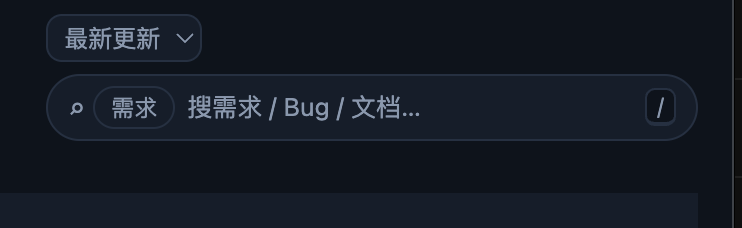

# REQ-20260910-025 排序下拉组件要和搜索框平齐

- 创建：2026-09-10T09:08:31.457Z
- 状态以本条目 status.json 和看板为准。

## 描述

需求模块第三行定位控件组里，排序下拉（`#reqSort`）与当前模块搜索框（`.module-search`）目前高度不一致，空间不足时还会上下堆叠，视觉上不平齐（用户截图现象：下拉矮一截叠在搜索框上方）：

本需求要求两者**平齐**呈现：常规宽度下排序下拉与搜索框同一行相邻（排序在左、搜索在右，沿用 REQ-20260910-016 的组内顺序），且高度一致、上下边缘对齐，消除「下拉矮一截 / 上下堆叠」的现象。本需求只约定布局与等高目标；排序、搜索的功能行为与显隐口径均沿用现状，不新增能力。

### 已核实的现状与范围

- `scripts/web/index.html`（第 60-81 行）：第三行 `#pageHead` = 模块副标题 `#moduleSub` + 定位组 `#locateGroup`；组内为排序下拉 `#reqSort`（`.sort-select`）与搜索组 `.global-search.module-search`（放大镜图标、范围标签 `#searchScope`、输入框 `#searchInput`、清除按钮 `#searchClear`、快捷键提示 `/`）。
- `scripts/web/style.css`：
  - `.locate-group`（第 184-192 行）：flex、`align-items: center`、`flex-wrap: wrap`、gap 6px、宽屏整组 `margin-left: auto` 靠右——组内空间不足时允许换行，形成截图中的上下堆叠。
  - `.sort-select`（第 376-385 行）：固定 `height: 24px`、12px 字号、8px 小圆角；搜索组 `.global-search`（第 1045-1056 行）为 99px 胶囊造型，内 `.search-input`（第 1065-1076 行）12.5px 字号、`padding: 6px 2px`，容器实际渲染高约 31-32px——两者高度差约 7-8px，同行时高矮不齐。
  - ≤720px 媒体查询（第 1642-1649 行）：副标题与定位组分行、组独占整行、搜索 `flex: 1 1 auto` 可伸缩。
- `scripts/web/app.js`：`syncReqSortVisibility`（第 1202-1205 行）——`#reqSort` 仅需求模块且看板已初始化时可见，切模块隐藏、回需求恢复；排序五选项（最新/最早更新、最新/最早创建、单号），默认最新更新，偏好记忆 localStorage（`atb.req.sort`），切换即重排。
- 样式复用注意：`.sort-select` 另被讨论筛选条行末复用（`.oncall-filters .sort-select`，style.css 第 1743 行），`.search-input` 被全局面板搜索复用（style.css 第 2036 行）——调整样式时不得破坏这些既有位置。
- 本需求不涉及排序选项增减、搜索逻辑变更与其它行的布局调整。

### 界面布局

- 常规桌面宽度：第三行左侧为模块副标题，右侧为定位控件组；组内顺序保持「排序下拉 → 搜索框」，两者同一行相邻、垂直居中，**高度一致、上下边缘平齐**（等高呈现）。
- 排序下拉保持可读造型；是否随搜索框统一为胶囊造型、等高后的具体像素值：无视觉稿，待确认（见文末），验收只约束「等高平齐」，不约束具体像素与造型。
- 极窄宽度沿用既有分行与伸缩约定（副标题与定位组分行、组占满整行、搜索可收缩）：不裁切、不遮挡控件、不产生页面横向滚动；排序与搜索的左右先后关系保持。
- 排序下拉隐藏（非需求模块或未初始化）时，搜索框位置保持稳定，不留占位空洞。

### 交互行为

- 排序：沿用五个选项与默认值，切换后即按所选规则重排当前过滤结果并记忆偏好；不清空搜索词、不改变状态筛选。
- 搜索：范围标签常显、清除按钮有词时出现、点击 / Esc 清空并把焦点交还输入框、`/` 聚焦、输入防抖——全部沿用现状。
- 键盘：Tab 顺序仍为排序 → 搜索，焦点轮廓可见。
- 平齐调整为纯视觉改动，不新增任何交互副作用。

### 状态反馈

- 正常：定位组按当前排序与关键词呈现结果，排序与搜索保持平齐、位置稳定。
- 空结果：保留排序与关键词，搜索反馈条提示无匹配并可清空关键词恢复；切换排序不伪造命中。
- 加载：定位组与当前值保持原位，反馈「搜索中」，不把加载误报为空结果。
- 失败：反馈搜索失败并保留恢复入口与机制；重试不重置排序与关键词。
- 搜索反馈条位置保持在副标题/定位组行下方，不混入定位组。

## 界面展示

打开 [可交互界面演示](./ui-demo.html)。单文件离线演示（示例数据）展示第三行「副标题 + 定位组」布局，提供「现状（不平齐）/ 平齐后」对照开关（含窄宽度下组内换行堆叠的现状模拟），可实际切换五种排序、输入 / 清除 / Esc 搜索、切换需求 / 任务模块观察排序下拉显隐，并切换正常 / 空 / 加载 / 失败四类状态；另含深浅色切换。布局、交互与状态反馈以本节及上文文字为验收依据；演示中的数据与加载 / 失败按钮用于模拟，不是新增生产功能。

## 验收标准

- [ ] 常规桌面宽度下，需求模块排序下拉与当前模块搜索框同一行相邻呈现（排序在左、搜索在右），不再出现截图中的上下堆叠错位。
- [ ] 两者高度一致、上下边缘平齐（等高），垂直居中对齐；消除现状 24px 与约 31-32px 的高度差（最终像素以开发实现为准）。
- [ ] 平齐调整不改变既有行为：五选项、默认最新更新、localStorage 记忆、切换即重排；搜索范围标签、清除按钮、Esc、`/` 聚焦、防抖与反馈条行为均不变。
- [ ] `#reqSort` 显隐口径不变：仅需求模块且看板已初始化时可见；隐藏时搜索框位置稳定、无占位空洞。
- [ ] 复用 `.sort-select` / `.search-input` 样式的其它位置（讨论筛选条行末排序、全局面板搜索）视觉与行为不被破坏。
- [ ] 窄屏（≤720px 断点）沿用既有分行 / 伸缩约定：无裁切、遮挡与横向溢出；排序与搜索左右先后关系保持（是否所有宽度恒同行见「待确认」第 1 条，按最终确认口径验收）。
- [ ] 正常、空、加载、失败四类状态下，定位组位置与平齐关系保持稳定，反馈条在定位组下方。
- [ ] README 链接可直接打开 ui-demo.html：无联网、无构建要求；现状 / 平齐对照、排序与搜索操作、模块切换与四类状态均可实际操作。

## 待确认

- 「平齐」是否要求所有窗口宽度下（含极窄宽度）排序与搜索恒不换行：待确认。当前验收按「常规宽度同行 + 等高；极窄沿用 REQ-20260910-016 允许分行 / 伸缩的口径、不裁切不溢出」执行；若确认要求恒同行，需同步调整 ≤720px 媒体查询的既有约定。
- 等高后的目标高度像素值与下拉造型（是否统一为胶囊）：项目未提供视觉稿，待确认；验收不约束具体像素与造型。
- 用户截图时的窗口宽度未记录（截图为局部区域），不影响「同行 + 等高」的目标定义。
